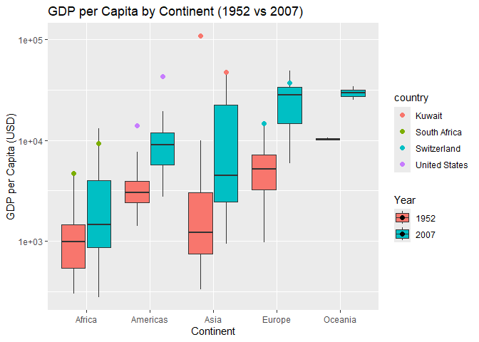
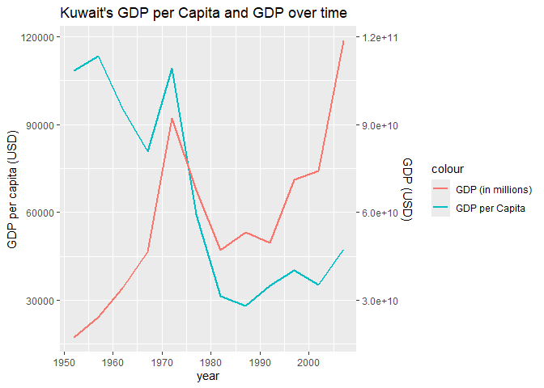
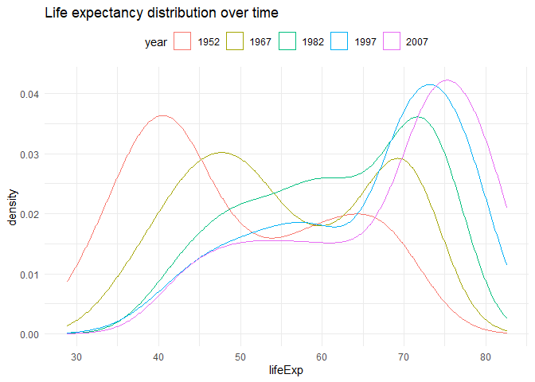

Gapminder
================
Christopher Nie
2025-03-01

- [Grading Rubric](#grading-rubric)
  - [Individual](#individual)
  - [Submission](#submission)
- [Guided EDA](#guided-eda)
  - [**q0** Perform your “first checks” on the dataset. What variables
    are in this
    dataset?](#q0-perform-your-first-checks-on-the-dataset-what-variables-are-in-this-dataset)
  - [**q1** Determine the most and least recent years in the `gapminder`
    dataset.](#q1-determine-the-most-and-least-recent-years-in-the-gapminder-dataset)
  - [**q2** Filter on years matching `year_min`, and make a plot of the
    GDP per capita against continent. Choose an appropriate `geom_` to
    visualize the data. What observations can you
    make?](#q2-filter-on-years-matching-year_min-and-make-a-plot-of-the-gdp-per-capita-against-continent-choose-an-appropriate-geom_-to-visualize-the-data-what-observations-can-you-make)
  - [**q3** You should have found *at least* three outliers in q2 (but
    possibly many more!). Identify those outliers (figure out which
    countries they
    are).](#q3-you-should-have-found-at-least-three-outliers-in-q2-but-possibly-many-more-identify-those-outliers-figure-out-which-countries-they-are)
  - [**q4** Create a plot similar to yours from q2 studying both
    `year_min` and `year_max`. Find a way to highlight the outliers from
    q3 on your plot *in a way that lets you identify which country is
    which*. Compare the patterns between `year_min` and
    `year_max`.](#q4-create-a-plot-similar-to-yours-from-q2-studying-both-year_min-and-year_max-find-a-way-to-highlight-the-outliers-from-q3-on-your-plot-in-a-way-that-lets-you-identify-which-country-is-which-compare-the-patterns-between-year_min-and-year_max)
- [Your Own EDA](#your-own-eda)
  - [**q5** Create *at least* three new figures below. With each figure,
    try to pose new questions about the
    data.](#q5-create-at-least-three-new-figures-below-with-each-figure-try-to-pose-new-questions-about-the-data)

*Purpose*: Learning to do EDA well takes practice! In this challenge
you’ll further practice EDA by first completing a guided exploration,
then by conducting your own investigation. This challenge will also give
you a chance to use the wide variety of visual tools we’ve been
learning.

<!-- include-rubric -->

# Grading Rubric

<!-- -------------------------------------------------- -->

Unlike exercises, **challenges will be graded**. The following rubrics
define how you will be graded, both on an individual and team basis.

## Individual

<!-- ------------------------- -->

| Category | Needs Improvement | Satisfactory |
|----|----|----|
| Effort | Some task **q**’s left unattempted | All task **q**’s attempted |
| Observed | Did not document observations, or observations incorrect | Documented correct observations based on analysis |
| Supported | Some observations not clearly supported by analysis | All observations clearly supported by analysis (table, graph, etc.) |
| Assessed | Observations include claims not supported by the data, or reflect a level of certainty not warranted by the data | Observations are appropriately qualified by the quality & relevance of the data and (in)conclusiveness of the support |
| Specified | Uses the phrase “more data are necessary” without clarification | Any statement that “more data are necessary” specifies which *specific* data are needed to answer what *specific* question |
| Code Styled | Violations of the [style guide](https://style.tidyverse.org/) hinder readability | Code sufficiently close to the [style guide](https://style.tidyverse.org/) |

## Submission

<!-- ------------------------- -->

Make sure to commit both the challenge report (`report.md` file) and
supporting files (`report_files/` folder) when you are done! Then submit
a link to Canvas. **Your Challenge submission is not complete without
all files uploaded to GitHub.**

``` r
library(tidyverse)
```

    ## ── Attaching core tidyverse packages ──────────────────────── tidyverse 2.0.0 ──
    ## ✔ dplyr     1.1.4     ✔ readr     2.1.5
    ## ✔ forcats   1.0.0     ✔ stringr   1.5.1
    ## ✔ ggplot2   3.5.1     ✔ tibble    3.2.1
    ## ✔ lubridate 1.9.4     ✔ tidyr     1.3.1
    ## ✔ purrr     1.0.2     
    ## ── Conflicts ────────────────────────────────────────── tidyverse_conflicts() ──
    ## ✖ dplyr::filter() masks stats::filter()
    ## ✖ dplyr::lag()    masks stats::lag()
    ## ℹ Use the conflicted package (<http://conflicted.r-lib.org/>) to force all conflicts to become errors

``` r
library(gapminder)
```

*Background*: [Gapminder](https://www.gapminder.org/about-gapminder/) is
an independent organization that seeks to educate people about the state
of the world. They seek to counteract the worldview constructed by a
hype-driven media cycle, and promote a “fact-based worldview” by
focusing on data. The dataset we’ll study in this challenge is from
Gapminder.

# Guided EDA

<!-- -------------------------------------------------- -->

First, we’ll go through a round of *guided EDA*. Try to pay attention to
the high-level process we’re going through—after this guided round
you’ll be responsible for doing another cycle of EDA on your own!

### **q0** Perform your “first checks” on the dataset. What variables are in this dataset?

``` r
names(gapminder)
```

    ## [1] "country"   "continent" "year"      "lifeExp"   "pop"       "gdpPercap"

``` r
summary(select(gapminder, year, pop, lifeExp,gdpPercap))
```

    ##       year           pop               lifeExp        gdpPercap       
    ##  Min.   :1952   Min.   :6.001e+04   Min.   :23.60   Min.   :   241.2  
    ##  1st Qu.:1966   1st Qu.:2.794e+06   1st Qu.:48.20   1st Qu.:  1202.1  
    ##  Median :1980   Median :7.024e+06   Median :60.71   Median :  3531.8  
    ##  Mean   :1980   Mean   :2.960e+07   Mean   :59.47   Mean   :  7215.3  
    ##  3rd Qu.:1993   3rd Qu.:1.959e+07   3rd Qu.:70.85   3rd Qu.:  9325.5  
    ##  Max.   :2007   Max.   :1.319e+09   Max.   :82.60   Max.   :113523.1

``` r
summarize(gapminder, n_distinct(country))
```

    ## # A tibble: 1 × 1
    ##   `n_distinct(country)`
    ##                   <int>
    ## 1                   142

``` r
summarize(gapminder, n_distinct(continent))
```

    ## # A tibble: 1 × 1
    ##   `n_distinct(continent)`
    ##                     <int>
    ## 1                       5

``` r
## TASK: Do your "first checks" here!
```

**Observations**:

- Country
- Continent
- Year
- Pop (Population)
- LifeExp
- gdpPerCap

### **q1** Determine the most and least recent years in the `gapminder` dataset.

*Hint*: Use the `pull()` function to get a vector out of a tibble.
(Rather than the `$` notation of base R.)

``` r
## TASK: Find the largest and smallest values of `year` in `gapminder`
year_max <- max(pull(gapminder, year))
year_min <- min(pull(gapminder, year))
```

Use the following test to check your work.

``` r
## NOTE: No need to change this
assertthat::assert_that(year_max %% 7 == 5)
```

    ## [1] TRUE

``` r
assertthat::assert_that(year_max %% 3 == 0)
```

    ## [1] TRUE

``` r
assertthat::assert_that(year_min %% 7 == 6)
```

    ## [1] TRUE

``` r
assertthat::assert_that(year_min %% 3 == 2)
```

    ## [1] TRUE

``` r
if (is_tibble(year_max)) {
  print("year_max is a tibble; try using `pull()` to get a vector")
  assertthat::assert_that(False)
}

print("Nice!")
```

    ## [1] "Nice!"

### **q2** Filter on years matching `year_min`, and make a plot of the GDP per capita against continent. Choose an appropriate `geom_` to visualize the data. What observations can you make?

You may encounter difficulties in visualizing these data; if so document
your challenges and attempt to produce the most informative visual you
can.

``` r
df_q2 <- 
  gapminder %>% 
  filter(year == year_min)
df_q2 %>% 
  ggplot(aes(x = continent, y = gdpPercap)) +
  geom_boxplot() + 
  coord_flip()
```

<!-- -->

``` r
## TASK: Create a visual of gdpPercap vs continent
```

**Observations**:

- Asia has an outlier that completely warps the plot. If we graphed the
  densities, we would get something similar, with the medians /
  quartiles on the right side of the graph and a single outlier on the
  left.
- Europe has the biggest spread, with Oceania the smallest. However,
  this may be due to a limited amount of data / countries reported from
  Oceania. The smallest spread of “major” continents is Africa, which
  also has the lowest median across all the continents.

**Difficulties & Approaches**:

- It would be interesting to see the plots with a rescaled plot that
  removes the plot-warping outlier to better show the relationships
  between the medians and quartiles.
- It would be interesting to see how many data points are in each
  continent, which may help explain Oceania having the highest
  gdpPerCapita and its small / nonexistent spread.

### **q3** You should have found *at least* three outliers in q2 (but possibly many more!). Identify those outliers (figure out which countries they are).

``` r
df_q3 <- 
  df_q2 %>% 
  # find the quartiles of the individual continents
  group_by(continent) %>% 
  mutate(
    Q1 = quantile(gdpPercap, .25), 
    Q3 = quantile(gdpPercap, .75), 
    IQR = Q3 - Q1, 
    lower_bound = Q1 - 1.5 * IQR, 
    upper_bound = Q3 + 1.5 * IQR
  ) %>% 
  ungroup() %>% 
  filter(gdpPercap < lower_bound | gdpPercap > upper_bound) %>% 
  # arrange by descending order so we can see the biggest outliers first
  arrange(desc(gdpPercap))

df_q3
```

    ## # A tibble: 9 × 11
    ##   country continent  year lifeExp    pop gdpPercap    Q1    Q3   IQR lower_bound
    ##   <fct>   <fct>     <int>   <dbl>  <int>     <dbl> <dbl> <dbl> <dbl>       <dbl>
    ## 1 Kuwait  Asia       1952    55.6 1.6 e5   108382.  750. 3035. 2286.      -2679.
    ## 2 Switze… Europe     1952    69.6 4.82e6    14734. 3241. 7237. 3996.      -2752.
    ## 3 United… Americas   1952    68.4 1.58e8    13990. 2428. 3940. 1512.        161.
    ## 4 Canada  Americas   1952    68.8 1.48e7    11367. 2428. 3940. 1512.        161.
    ## 5 Bahrain Asia       1952    50.9 1.20e5     9867.  750. 3035. 2286.      -2679.
    ## 6 Venezu… Americas   1952    55.1 5.44e6     7690. 2428. 3940. 1512.        161.
    ## 7 South … Africa     1952    45.0 1.43e7     4725.  535. 1455.  920.       -845.
    ## 8 Gabon   Africa     1952    37.0 4.21e5     4293.  535. 1455.  920.       -845.
    ## 9 Angola  Africa     1952    30.0 4.23e6     3521.  535. 1455.  920.       -845.
    ## # ℹ 1 more variable: upper_bound <dbl>

``` r
## TASK: Identify the outliers from q2
```

**Observations**:

- Identify the outlier countries from q2
  - Kuwait
  - Switzerland
  - United States

*Hint*: For the next task, it’s helpful to know a ggplot trick we’ll
learn in an upcoming exercise: You can use the `data` argument inside
any `geom_*` to modify the data that will be plotted *by that geom
only*. For instance, you can use this trick to filter a set of points to
label:

``` r
## NOTE: No need to edit, use ideas from this in q4 below
gapminder %>%
  filter(year == max(year)) %>%

  ggplot(aes(continent, lifeExp)) +
  geom_boxplot() +
  geom_point(
    data = . %>% filter(country %in% c("United Kingdom", "Japan", "Zambia")),
    mapping = aes(color = country),
    size = 2
  )
```

<!-- -->

### **q4** Create a plot similar to yours from q2 studying both `year_min` and `year_max`. Find a way to highlight the outliers from q3 on your plot *in a way that lets you identify which country is which*. Compare the patterns between `year_min` and `year_max`.

*Hint*: We’ve learned a lot of different ways to show multiple
variables; think about using different aesthetics or facets.

``` r
gapminder_filtered <- gapminder %>%
  filter(year %in% c(year_min, year_max))
gapminder_filtered %>% 
  ggplot(aes(x = continent, y = gdpPercap, fill = as.factor(year))) +
  geom_boxplot(position = position_dodge(width = 0.8), outlier.shape = NA) + 
  labs(
    title = "GDP per Capita by Continent (1952 vs 2007)",
    x = "Continent",
    y = "GDP per Capita (USD)",
    fill = "Year"
  ) + 
  geom_point(
    data = . %>% filter(country %in% c("Kuwait", "Switzerland", "United States", "South Africa")),
    mapping = aes(color = country),
    position = position_dodge(width = 0.8), 
    size = 2
  ) 
```

<!-- -->

``` r
## TASK: Create a visual of gdpPercap vs continent
```

**Observations**:

- Generally, we can see that the median increased from 1952 to 2007.
  However, we can also see that the IQR increases. This suggests that
  the GDP of certain countries did not increase as fast as other
  countries. However, we can see that generally, the lower quartile for
  each continent in 2007 is higher than the lower quartile for each
  continent in 1952. Although that makes it seem like no countries had
  GDP per capita that outright dropped, we can see from our outliers
  that Kuwait, which had the highest GDP per capita in 1957 but dropped
  into the maximum and minimum range of the box plots. This can either
  be due to 1) a dropping GDP or 2) an increase in population that is
  not matched by GDP growth.

# Your Own EDA

<!-- -------------------------------------------------- -->

Now it’s your turn! We just went through guided EDA considering the GDP
per capita at two time points. You can continue looking at outliers,
consider different years, repeat the exercise with `lifeExp`, consider
the relationship between variables, or something else entirely.

### **q5** Create *at least* three new figures below. With each figure, try to pose new questions about the data.

1.  I am interested in looking at the time history of Kuwait’s GDP per
    capita and its population to see if the GDP actually dropped over
    time or if it was the population.

``` r
df_q5 <- 
  gapminder %>% 
  filter(country == "Kuwait") %>% 
  mutate(gdp = gdpPercap*pop)
df_q5 %>% 
  ggplot(aes(x=year)) + 
  geom_line(aes(y=gdpPercap, color = "GDP per Capita"), linewidth = 1) +
  geom_line(aes(y=gdp / 1e6, color = "GDP (in millions)"), linewidth = 1) + 
  scale_y_continuous(
    name = "GDP per capita (USD)", 
    sec.axis = sec_axis(~ . * 1e6, name = "GDP (USD)")
  )
```

<!-- -->

- Kuwait’s GDP in 2007 is higher than in 1957. Thus, it looks like the
  population increased at a rate that was not reflected in its GDP
  growth. Thus, we can expect the lower GDP per capita to be reflected
  in lower standards of living. It can also be seen that Kuwait’s GDP
  fell between 1972 and 1982. This “fall” is only perceived due to the
  overbearing spike it saw between 1967 and 1972. If this spike is to be
  ignored, Kuwait’s could almost be described as steadily growing at a
  predictable rate. Nevertheless, this makes this spike ever the more
  worth studying.

2.  What does life expectancy look like over the years? What would it
    look like if we lumped all the data for a year together and created
    a density distribution?

``` r
# Filter the data for the specified years
selected_years <- c(1952, 1967, 1982, 1997, 2007)

df_q5_2 <- gapminder %>%
  mutate(year = as.factor(year)) %>% 
  filter(year %in% selected_years)

# Create the density plot
df_q5_2 %>% 
  ggplot(aes(x = lifeExp, color = year)) +
  geom_density(alpha = 0.3) + # Density plot with transparency
  
  theme_minimal() +
  theme(legend.position = "top") 
```

<!-- -->

``` r
## TASK: Your second graph
# life expectancy density distribution? by year? by continent? 
```

- In general, we can see that life expectancy tended to go up as time
  went by. This is due to increases in technology, healthcare, and
  health sciences. One interesting observation is that the life
  expectancy in 1952 and 1967 almost looked bimodal. If we look at Q4’s
  sample graph (and change `filter(year == max(year))` to
  `filter(year == min(year))`, then we can see that the median is quite
  spread out across the continents. This could be a reason that we see
  the bimodal distribution. Additionally, since the probability
  distribution shows the mode, we can see where exactly the highest
  concentrations of life expectancies are. Thus, it is the most faithful
  way of lumping all the data together. However, one weakness of this
  method of representation is that if there are more data points from
  Africa (which had the lowest life expectancy at this time period),
  then the representation would be likewise skewed. If we lumped all the
  data into a Box-and-whisker plot, we would be unable to see the two
  modes and would instead see something in the middle. However, the box
  and whisker comes with the added benefit that (if we do choose to
  separate the continents), the median is adjusted to that group. Trying
  to do the same with a density distribution may create a plot that is
  too cluttered.
- Another observation we can see is that even in 2007, there are certain
  countries with a life expectancy of 40.
- Ultimately, `gapminder` does not give information on demographics,
  such as sex, which does have a statistically significant relationship
  with life expectancy.
- Another observation we get is that the spread of the distribution
  tended to increase with time as well. This is especially noticeable
  during the time between 1982 and 2007. This suggests that there is
  unequal improvements in healthcare among the countries represented by
  this dataset.

3.  Does GDP per capita have a relationship with life expectancy? After
    all, GDP per capita can be correlated with standards of living, as
    well as progress in healthcare.

``` r
ggplot(df_q5_2, aes(x = gdpPercap, y = lifeExp, color = year)) +   
  geom_point(alpha = 0.6, size = 2) +
  geom_smooth(method = "loess", se = FALSE, linewidth = 1) +
  scale_x_log10() + # Log scale for GDP per capita
  labs(
    title = "Relationship Between GDP per Capita and Life Expectancy (1952-2007)",
    x = "GDP per Capita (USD, log scale)",
    y = "Life Expectancy (years)",
    color = "Year"
  ) +
  theme_minimal() +
  theme(legend.position = "top") 
```

    ## `geom_smooth()` using formula = 'y ~ x'

<!-- -->

``` r
## TASK: Your third graph
# life expectancy vs GDP
```

- It looks like GDP per capita is correlated with life expectancy.
  Although the 1952 and 1967 has a dip in life expectancy, this is
  simply be due to the fact that we only have one country that was so
  rich at this time (Kuwait), and that skews the data at that range.
  However, this data might not be sufficient to say that GDP per capita
  is a leading cause in life expectancy. It is possible that both tend
  to increase with time, and as such, GDP per capita and life expectancy
  simply both increase with time. This is represented on the graph by
  the fact that the line with the highest life expectancy is simply the
  most recent year. Someone in a country with a GDP per capita at
  $5\times10^3$ in the year 2007 would have the same expected life
  expectancy as someone in a country with a GDP per capita of
  $3\times10^4$ in 1967 or 1952.
- The ultimate commonality might simply just be time as technology
  increases.
- 1952 and 1967 tend to follow the same line, while 1997 and 2007 tendt
  to follow the same line.
- It looks like the spread also decreases with time, with 2007 and 1997
  having some of the smallest spreads and 1952 having a larger spread.
  This might mean that countries got better at using their GDP per
  capita to increase life expectancy as technology increased.
