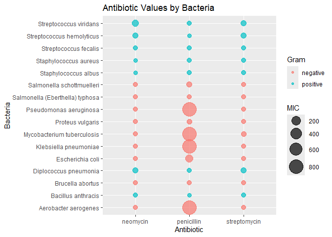
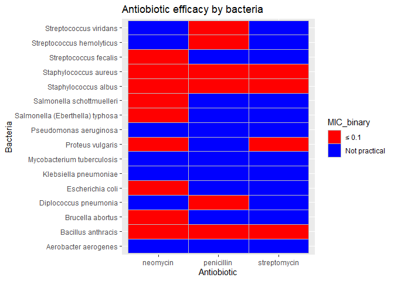
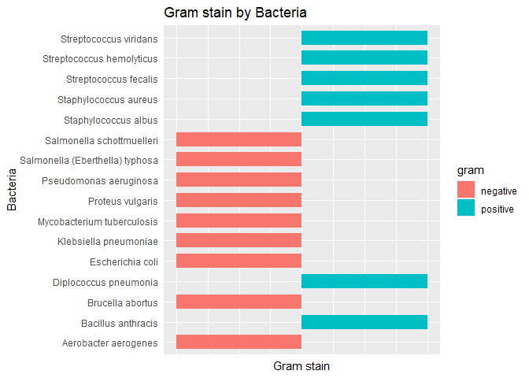
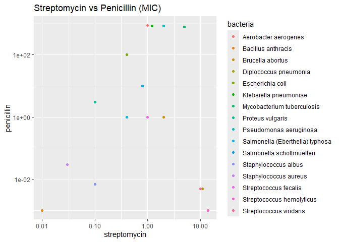

Antibiotics
================
Christopher Nie
2025-03-09

*Purpose*: Creating effective data visualizations is an *iterative*
process; very rarely will the first graph you make be the most
effective. The most effective thing you can do to be successful in this
iterative process is to *try multiple graphs* of the same data.

Furthermore, judging the effectiveness of a visual is completely
dependent on *the question you are trying to answer*. A visual that is
totally ineffective for one question may be perfect for answering a
different question.

In this challenge, you will practice *iterating* on data visualization,
and will anchor the *assessment* of your visuals using two different
questions.

*Note*: Please complete your initial visual design **alone**. Work on
both of your graphs alone, and save a version to your repo *before*
coming together with your team. This way you can all bring a diversity
of ideas to the table!

<!-- include-rubric -->

# Grading Rubric

<!-- -------------------------------------------------- -->

Unlike exercises, **challenges will be graded**. The following rubrics
define how you will be graded, both on an individual and team basis.

## Individual

<!-- ------------------------- -->

| Category | Needs Improvement | Satisfactory |
|----|----|----|
| Effort | Some task **q**’s left unattempted | All task **q**’s attempted |
| Observed | Did not document observations, or observations incorrect | Documented correct observations based on analysis |
| Supported | Some observations not clearly supported by analysis | All observations clearly supported by analysis (table, graph, etc.) |
| Assessed | Observations include claims not supported by the data, or reflect a level of certainty not warranted by the data | Observations are appropriately qualified by the quality & relevance of the data and (in)conclusiveness of the support |
| Specified | Uses the phrase “more data are necessary” without clarification | Any statement that “more data are necessary” specifies which *specific* data are needed to answer what *specific* question |
| Code Styled | Violations of the [style guide](https://style.tidyverse.org/) hinder readability | Code sufficiently close to the [style guide](https://style.tidyverse.org/) |

## Submission

<!-- ------------------------- -->

Make sure to commit both the challenge report (`report.md` file) and
supporting files (`report_files/` folder) when you are done! Then submit
a link to Canvas. **Your Challenge submission is not complete without
all files uploaded to GitHub.**

``` r
library(tidyverse)
```

    ## ── Attaching core tidyverse packages ──────────────────────── tidyverse 2.0.0 ──
    ## ✔ dplyr     1.1.4     ✔ readr     2.1.5
    ## ✔ forcats   1.0.0     ✔ stringr   1.5.1
    ## ✔ ggplot2   3.5.1     ✔ tibble    3.2.1
    ## ✔ lubridate 1.9.4     ✔ tidyr     1.3.1
    ## ✔ purrr     1.0.2     
    ## ── Conflicts ────────────────────────────────────────── tidyverse_conflicts() ──
    ## ✖ dplyr::filter() masks stats::filter()
    ## ✖ dplyr::lag()    masks stats::lag()
    ## ℹ Use the conflicted package (<http://conflicted.r-lib.org/>) to force all conflicts to become errors

``` r
library(ggrepel)
```

*Background*: The data\[1\] we study in this challenge report the
[*minimum inhibitory
concentration*](https://en.wikipedia.org/wiki/Minimum_inhibitory_concentration)
(MIC) of three drugs for different bacteria. The smaller the MIC for a
given drug and bacteria pair, the more practical the drug is for
treating that particular bacteria. An MIC value of *at most* 0.1 is
considered necessary for treating human patients.

These data report MIC values for three antibiotics—penicillin,
streptomycin, and neomycin—on 16 bacteria. Bacteria are categorized into
a genus based on a number of features, including their resistance to
antibiotics.

``` r
## NOTE: If you extracted all challenges to the same location,
## you shouldn't have to change this filename
filename <- "./data/antibiotics.csv"

## Load the data
df_antibiotics <- read_csv(filename)
```

    ## Rows: 16 Columns: 5
    ## ── Column specification ────────────────────────────────────────────────────────
    ## Delimiter: ","
    ## chr (2): bacteria, gram
    ## dbl (3): penicillin, streptomycin, neomycin
    ## 
    ## ℹ Use `spec()` to retrieve the full column specification for this data.
    ## ℹ Specify the column types or set `show_col_types = FALSE` to quiet this message.

``` r
df_antibiotics %>% knitr::kable()
```

| bacteria                        | penicillin | streptomycin | neomycin | gram     |
|:--------------------------------|-----------:|-------------:|---------:|:---------|
| Aerobacter aerogenes            |    870.000 |         1.00 |    1.600 | negative |
| Brucella abortus                |      1.000 |         2.00 |    0.020 | negative |
| Bacillus anthracis              |      0.001 |         0.01 |    0.007 | positive |
| Diplococcus pneumonia           |      0.005 |        11.00 |   10.000 | positive |
| Escherichia coli                |    100.000 |         0.40 |    0.100 | negative |
| Klebsiella pneumoniae           |    850.000 |         1.20 |    1.000 | negative |
| Mycobacterium tuberculosis      |    800.000 |         5.00 |    2.000 | negative |
| Proteus vulgaris                |      3.000 |         0.10 |    0.100 | negative |
| Pseudomonas aeruginosa          |    850.000 |         2.00 |    0.400 | negative |
| Salmonella (Eberthella) typhosa |      1.000 |         0.40 |    0.008 | negative |
| Salmonella schottmuelleri       |     10.000 |         0.80 |    0.090 | negative |
| Staphylococcus albus            |      0.007 |         0.10 |    0.001 | positive |
| Staphylococcus aureus           |      0.030 |         0.03 |    0.001 | positive |
| Streptococcus fecalis           |      1.000 |         1.00 |    0.100 | positive |
| Streptococcus hemolyticus       |      0.001 |        14.00 |   10.000 | positive |
| Streptococcus viridans          |      0.005 |        10.00 |   40.000 | positive |

# Visualization

<!-- -------------------------------------------------- -->

### **q1** Prototype 5 visuals

To start, construct **5 qualitatively different visualizations of the
data** `df_antibiotics`. These **cannot** be simple variations on the
same graph; for instance, if two of your visuals could be made identical
by calling `coord_flip()`, then these are *not* qualitatively different.

For all five of the visuals, you must show information on *all 16
bacteria*. For the first two visuals, you must *show all variables*.

*Hint 1*: Try working quickly on this part; come up with a bunch of
ideas, and don’t fixate on any one idea for too long. You will have a
chance to refine later in this challenge.

*Hint 2*: The data `df_antibiotics` are in a *wide* format; it may be
helpful to `pivot_longer()` the data to make certain visuals easier to
construct.

#### Visual 1 (All variables)

In this visual you must show *all three* effectiveness values for *all
16 bacteria*. This means **it must be possible to identify each of the
16 bacteria by name.** You must also show whether or not each bacterium
is Gram positive or negative.

``` r
# WRITE YOUR CODE HERE
df_antibiotics_long <- 
  df_antibiotics %>% 
  pivot_longer(
    cols = c(penicillin, streptomycin, neomycin), 
    names_to = "antibiotic", 
    values_to = "MIC"
  )
df_antibiotics_long %>% 
  ggplot(aes(
    x = MIC, 
    y = bacteria, 
    color = antibiotic, 
    shape = gram)) + 
  scale_x_log10() + 
  geom_jitter(
    width = 0,
    height = 0.3,
    )  + 
  labs(
    title = "Antibiotic Values by Bacteria", 
    x = "MIC (log scale)", 
    y = "Bacteria", 
    color = "Antibiotic", 
    shape = "Gram"
  )
```

<!-- -->

#### Visual 2 (All variables)

In this visual you must show *all three* effectiveness values for *all
16 bacteria*. This means **it must be possible to identify each of the
16 bacteria by name.** You must also show whether or not each bacterium
is Gram positive or negative.

Note that your visual must be *qualitatively different* from *all* of
your other visuals.

``` r
# WRITE YOUR CODE HERE
df_antibiotics_long %>% 
  ggplot(aes(x = antibiotic, y = bacteria, size = MIC, color = gram)) + 
  geom_point(alpha = .7) + 
  scale_size_continuous(range = c(3,10))+ 
  labs(
    title = "Antibiotic Values by Bacteria", 
    x = "Antibiotic", 
    y = "Bacteria", 
    color = "Gram", 
    size = "MIC"
  )
```

<!-- -->

#### Visual 3 (Some variables)

In this visual you may show a *subset* of the variables (`penicillin`,
`streptomycin`, `neomycin`, `gram`), but you must still show *all 16
bacteria*.

Note that your visual must be *qualitatively different* from *all* of
your other visuals.

``` r
# WRITE YOUR CODE HERE
threshold <- .1
df_antibiotics_long %>% 
  mutate(MIC_binary = ifelse(MIC <= threshold, paste("≤", threshold), "Not practical")) %>% 
  ggplot(aes(x = antibiotic, y = bacteria, fill = MIC_binary)) +
  geom_tile(color = "gray") +
  scale_fill_manual(values = c("≤ 0.1" = "red", "Not practical" = "blue")) +
  labs(
    title = "Antiobiotic efficacy by bacteria", 
    x = "Antiobiotic", 
    y = "Bacteria", 
    color = "MIC practicality", 
  )
```

<!-- -->

#### Visual 4 (Some variables)

In this visual you may show a *subset* of the variables (`penicillin`,
`streptomycin`, `neomycin`, `gram`), but you must still show *all 16
bacteria*.

Note that your visual must be *qualitatively different* from *all* of
your other visuals.

``` r
# WRITE YOUR CODE HERE
df_antibiotics_long %>% 
  distinct(bacteria, gram) %>% 
  mutate(gram_numeric = ifelse(gram == "positive", 1, -1)) %>% 
  ggplot(aes(x = gram_numeric, y = bacteria, fill = gram)) +
  geom_bar(stat = "identity", width = .7) + 
  theme(axis.text.x = element_blank(),
        axis.ticks = element_blank()) + 
  labs(
    title = "Gram stain by Bacteria", 
    x = "Gram stain", 
    y = "Bacteria", 
    color = "Gram"
  )
```

<!-- -->

#### Visual 5 (Some variables)

In this visual you may show a *subset* of the variables (`penicillin`,
`streptomycin`, `neomycin`, `gram`), but you must still show *all 16
bacteria*.

Note that your visual must be *qualitatively different* from *all* of
your other visuals.

``` r
# WRITE YOUR CODE HERE
df_antibiotics %>% 
  arrange(gram) %>%
  ggplot(aes(x=streptomycin, y=neomycin, color = bacteria)) + 
  geom_point() + 
  scale_x_log10() + 
  scale_y_log10() + 
  labs(title ="Streptomycin vs Neomycin (MIC)")
```

<!-- -->

``` r
df_antibiotics %>% 
  arrange(gram) %>%
  ggplot(aes(x=streptomycin, y=penicillin, color = bacteria)) + 
  geom_point()+ 
  scale_x_log10() + 
  scale_y_log10() + 
  labs(title ="Streptomycin vs Penicillin (MIC)")
```

<!-- -->

### **q2** Assess your visuals

There are **two questions** below; use your five visuals to help answer
both Guiding Questions. Note that you must also identify which of your
five visuals were most helpful in answering the questions.

*Hint 1*: It’s possible that *none* of your visuals is effective in
answering the questions below. You may need to revise one or more of
your visuals to answer the questions below!

*Hint 2*: It’s **highly unlikely** that the same visual is the most
effective at helping answer both guiding questions. **Use this as an
opportunity to think about why this is.**

#### Guiding Question 1

> How do the three antibiotics vary in their effectiveness against
> bacteria of different genera and Gram stain?

*Observations*

\- What is your response to the question above?

Of the seven gram-negative bacteria, **Penicillin** is effective for six
of them. **Neomycin** is effective for the remaining gram-negative
bacterium, *Streptococcus fecalis*, and is also more effective than
Penicillin for the two gram-negative bacteria of the *Staphylococcus*
genus. In fact, **Neomycin** is the most effective antibiotic for **11
of the 16 bacteria** among the three antibiotics tested. However, from
an objective efficacy standpoint, $MIC_{neomycin}≤0.1$ for only
**eight** of these species. This leaves **three species** where
$MIC>0.1$ for all three antibiotics, indicating limited treatment
options for these cases.

**Streptomycin** is the most effective choice only for *Aerobacter
aerogenes*, but even here, it is not highly effective, with an `MIC` of
approximately 1. Streptomycin is only truly effective
($MIC_{streptomycin}≤0.1$) for **four samples** overall.

In summary:

- **Penicillin** is useful for six of the seven gram-negative bacteria.

- **Neomycin** is the most effective for three of the seven
  gram-negative bacteria, including *Streptococcus fecalis*, where it is
  the only effective option.

- **Neomycin** is also the most effective for **all gram-positive
  bacteria** except for *Aerobacter aerogenes*.

Overall, **Neomycin** stands out as the most broadly effective
antibiotic, particularly for gram-positive bacteria, while
**Penicillin** remains as a strong choice for gram-negative bacteria.
However, the presence of three species with $MIC>0.1$ for all three
antibiotics highlights the need for alternative treatment cases that are
outside of this data set.

\- Which of your visuals above (1 through 5) is **most effective** at
helping to answer this question? Why?

I mostly used visual 1 (a scatter plot), 3 (a heatmap), and 4 (a
bidirectional bar chart).

- Visual 1 was most effective at comparing the relative `MIC` for the
  various antibiotics for each species of bacteria. Referring back to
  the visual hierarchy, this chart uses the elements of common scales
  and color hue. Thus, it was easy to compare the numeric values on the
  scale and the non-numeric antibiotic type with the colors. In this
  sense, the basic ideas of the visualization was easily communicated.
  However, it was ultimately cluttered by the fact that it needed to
  graph four variables. Furthermore, I had to use a **log scale**
  because of the outliers for Penicillin. Thus, it takes a while to get
  used and is not too intuitive to read.

- Visual 3 was most effective at seeing which antibiotics was practical
  ($MIC\le 0.1$). I chose to use a binary heatmap because I wanted to
  convey this idea easily, rather than a gradient that may be hard to
  read and would definitely be affected by the outliers for Penicillin.
  This let us make the claim that, although Neomycin was most effective
  for **11 of the 16 bacteria**, it was not practical for three of them.
  Although heat maps tend to fall prey to the fact that color
  saturation/hue is rank 6 and 7 on the visual hierarchy, I was able to
  go around this by making the heatmap binary, rather than a gradient.
  Thus, the ideas I wanted to convey were easily communicated.

- Visual 4 was a simple visualization that let us see which antibiotic
  was **gram-positive** and which was **gram-negative**. It was still
  effective at helping me answer this question, but this information
  could have probably been included in another visualization (perhaps
  using `facet_wrap`) and may not have warranted an entire
  visualization. Since there is no numeric data, I used direction and
  color to communicate my idea. Under the visual hierarchy, this would
  probably fit under (3) length and (7) color hue. However, since I am
  not communicating numeric data, the visual hierarchy is not a useful
  way to judge the information I am communicating. I believe that this
  graph was able to communicate what I wanted because it was simple and
  straightforward.

Two visualizations were not used at all

- Visual 2 was affected by the Penicillin outliers. Additionally, it
  attempts to use area as a way to show numeric data, which is rank 5
  under the visual hierarchy. Thus, it was difficult to use.

- Visual 5 was not too useful. Because of the range of values of each
  antibiotic, using a linear scale would mean being unable to see the
  smaller (actually important) values. Using a log scale would mean that
  each axis would scale with log differently. Penicillin ranged from
  .001 to 700, while Streptomycin ranged from .001 to 12. It was also
  difficult to intuit what the values even meant. Furthermore, sixteen
  colors meant that the color scheme was almost like a gradient, and
  thus it was difficult to identify which point was which bacteria.
  Thus, even though we were using a common scale plot to show numeric
  numbers, which was rank 1 on the visual hierarchy, it was difficult to
  understand what the visualization was attempting to show.

#### Guiding Question 2

In 1974 *Diplococcus pneumoniae* was renamed *Streptococcus pneumoniae*,
and in 1984 *Streptococcus fecalis* was renamed *Enterococcus fecalis*
\[2\].

> Why was *Diplococcus pneumoniae* was renamed *Streptococcus
> pneumoniae*?

*Observations*

\- What is your response to the question above?

The key characteristics of the *Streptococcus* genus of bacteria (at
least, according to the data) is that, 1) it is gram-negative, 2)
Penicillin is the most effective antibiotic by a large margin, and 3)
none of the other antibiotics are effective at treating it. From this
point of view, *Diplococcus pneumoniae* seems like it would match with
these characteristics of the *Streptoccocus* genus. In fact, perhaps
*Streptococcus fecalis* was removed from this genus because its
characteristics did not match the observations made about the
*Streptococcus* genus with regards to the most effective antibiotics.

\- Which of your visuals above (1 through 5) is **most effective** at
helping to answer this question? Why?

I used visualizations 1, 3, and 4, for primarily the same reasons
mentioned above. Additionally, these three graphs best separate the data
by bacteria species. Thus, it was easier to see the observations that
may have helped with these name changes.

# References

<!-- -------------------------------------------------- -->

\[1\] Neomycin in skin infections: A new topical antibiotic with wide
antibacterial range and rarely sensitizing. Scope. 1951;3(5):4-7.

\[2\] Wainer and Lysen, “That’s Funny…” *American Scientist* (2009)
[link](https://www.americanscientist.org/article/thats-funny)
