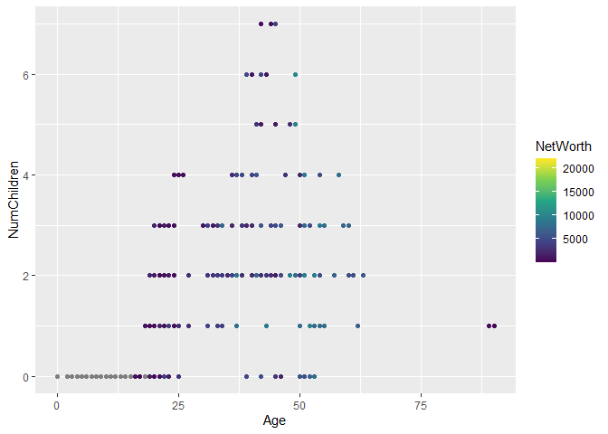
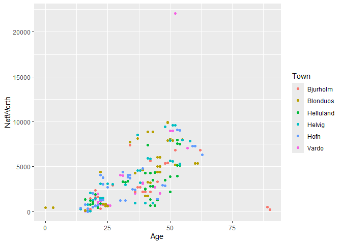
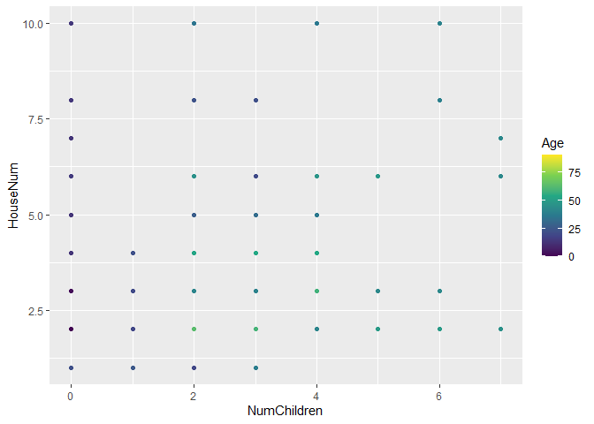
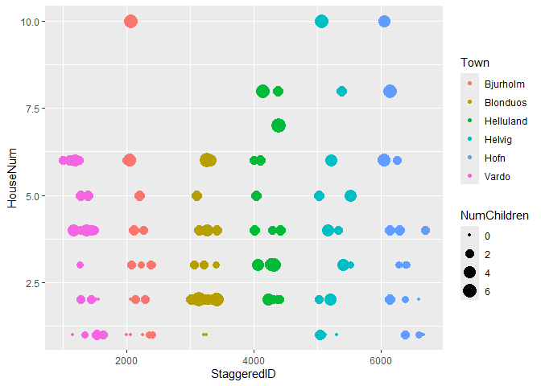
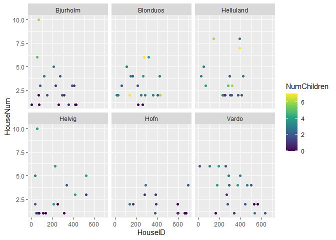
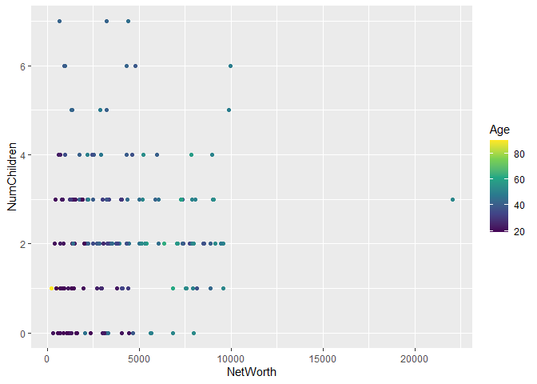
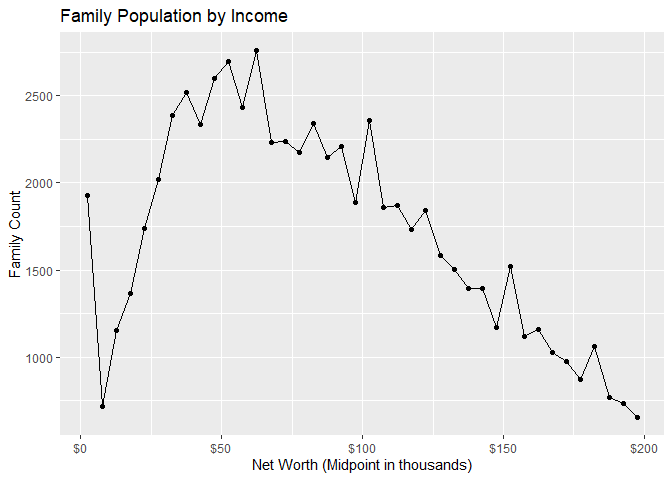
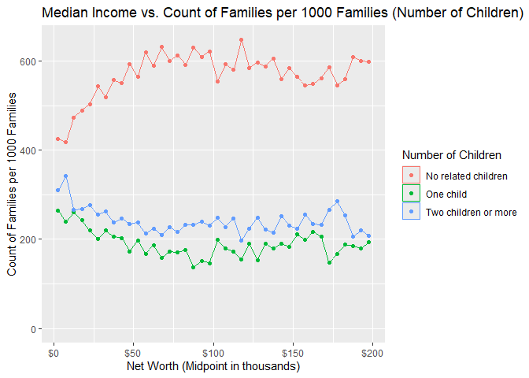
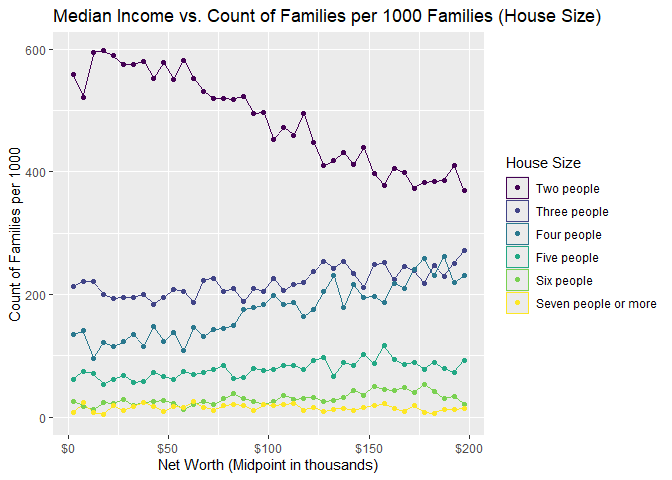

The Islands, Part 2: Study
================
(Your name here)
202X-XX-XX

- [Grading Rubric](#grading-rubric)
  - [Individual](#individual)
  - [Submission](#submission)
- [Setup](#setup)
  - [**q1** Planning a study (TEAMWORK)](#q1-planning-a-study-teamwork)
  - [**q2** EDA](#q2-eda)
  - [**q3** Key Analyses](#q3-key-analyses)
  - [**q4** Answers](#q4-answers)

*Purpose*: This is part 2 of 2. In part 1 you *planed* your statistical
project, particularly your data collection. In this part you will give
updates on your plan, and report your findings.

This challenge is deliberately shorter so you have time to collect and
analyze your data.

*Important note*: While we expect that you did your data collection with
your team, you need to complete your own individual report for c10.

<!-- include-rubric -->

# Grading Rubric

<!-- -------------------------------------------------- -->

Unlike exercises, **challenges will be graded**. The following rubrics
define how you will be graded, both on an individual and team basis.

## Individual

<!-- ------------------------- -->

| Category | Needs Improvement | Satisfactory |
|----|----|----|
| Effort | Some task **q**’s left unattempted | All task **q**’s attempted |
| Observed | Did not document observations, or observations incorrect | Documented correct observations based on analysis |
| Supported | Some observations not clearly supported by analysis | All observations clearly supported by analysis (table, graph, etc.) |
| Assessed | Observations include claims not supported by the data, or reflect a level of certainty not warranted by the data | Observations are appropriately qualified by the quality & relevance of the data and (in)conclusiveness of the support |
| Specified | Uses the phrase “more data are necessary” without clarification | Any statement that “more data are necessary” specifies which *specific* data are needed to answer what *specific* question |
| Code Styled | Violations of the [style guide](https://style.tidyverse.org/) hinder readability | Code sufficiently close to the [style guide](https://style.tidyverse.org/) |

## Submission

<!-- ------------------------- -->

Make sure to commit both the challenge report (`report.md` file) and
supporting files (`report_files/` folder) when you are done! Then submit
a link to Canvas. **Your Challenge submission is not complete without
all files uploaded to GitHub.**

# Setup

<!-- ----------------------------------------------------------------------- -->

``` r
library(tidyverse)
```

    ## ── Attaching core tidyverse packages ──────────────────────── tidyverse 2.0.0 ──
    ## ✔ dplyr     1.1.4     ✔ readr     2.1.5
    ## ✔ forcats   1.0.0     ✔ stringr   1.5.1
    ## ✔ ggplot2   3.5.1     ✔ tibble    3.2.1
    ## ✔ lubridate 1.9.4     ✔ tidyr     1.3.1
    ## ✔ purrr     1.0.2     
    ## ── Conflicts ────────────────────────────────────────── tidyverse_conflicts() ──
    ## ✖ dplyr::filter() masks stats::filter()
    ## ✖ dplyr::lag()    masks stats::lag()
    ## ℹ Use the conflicted package (<http://conflicted.r-lib.org/>) to force all conflicts to become errors

``` r
library(rsample)

# TODO: Include any other packages you need
```

### **q1** Planning a study (TEAMWORK)

While you provided this plan in c08 (Part 1), please include your plan
here. In particular, describe how you updated your plan in response to
feedback.

#### Population

- (What population are you going to study?)
  - All of the Islanders? Only the residents of Helvig? Participants
    meeting certain criteria (in which case, you need to list
    *covariates*)?

#### Quantity of interest

- (Write your quantity of interest here)

#### Covariates

- (Write any relevant covariates here)
- (There’s probably more than one!)

#### Observation or experiment?

The Islands allows you to ask islanders to complete tasks. If you just
take measurements on your participants, then it’s an *observational
study*. But if you also introduce something that’s meant to change the
outcome of a measurement (e.g., drinking coffee before taking a test),
that’s called an *experimental study*. You need to decide whether your
study is observational or experimental.

- (Observation or experiment?)

#### Question / Hypothesis

- (Write your question / hypothesis here)
  - This could be an observational question, like “How are X and Y
    related in the population?”
  - This could be an experimental question, like “What effect does X
    have on Y in the population?”

#### Sampling plan

- (What steps will you take to collect the data?)
  - Be specific. For instance, if you’re going to collect a random
    sample, how will you enumerate all of the things to be sampled?
  - Write a protocol. Document step-by-step instructions that your team
    will follow. That way, you can feasibly split up data collection
    among the whole team, while making sure each team member doesn’t
    make ad hoc decisions that introduce bias into your results.
- (How will you ensure the data is representative of your chosen
  population?)
- (For experiments only: How will you ensure any effects you observe are
  due to the treatment, and not due to other factors?)
- (How will you choose your sample size?)
  - This should be a mix of how confident you want to be in your
    results, and what is actually *feasible* for your research team.

### **q2** EDA

Conduct an EDA on your data. Add as many code chunks as you need. Ensure
your EDA gives enough context of the data for us to understand what
comes next in this report.

``` r
## NOTE: No need to edit
df_vardo <-
  read_csv("data/vardo_out.csv") %>% 
  mutate(Town = "Vardo")
```

    ## Rows: 57 Columns: 7
    ## ── Column specification ────────────────────────────────────────────────────────
    ## Delimiter: ","
    ## chr (3): HouseSize, Name, Occupation
    ## dbl (4): HouseID, NetWorth, Age, NumChildren
    ## 
    ## ℹ Use `spec()` to retrieve the full column specification for this data.
    ## ℹ Specify the column types or set `show_col_types = FALSE` to quiet this message.

``` r
df_hofn <- 
  read_csv("data/hofn_out.csv") %>% 
  mutate(Town = "Hofn")
```

    ## Rows: 46 Columns: 7
    ## ── Column specification ────────────────────────────────────────────────────────
    ## Delimiter: ","
    ## chr (3): HouseSize, Name, Occupation
    ## dbl (4): HouseID, NetWorth, Age, NumChildren
    ## 
    ## ℹ Use `spec()` to retrieve the full column specification for this data.
    ## ℹ Specify the column types or set `show_col_types = FALSE` to quiet this message.

``` r
df_helvig <- 
  read_csv("data/helvig_out.csv") %>% 
  mutate(Town = "Helvig")
```

    ## Rows: 55 Columns: 7
    ## ── Column specification ────────────────────────────────────────────────────────
    ## Delimiter: ","
    ## chr (3): HouseSize, Name, Occupation
    ## dbl (4): HouseID, NetWorth, Age, NumChildren
    ## 
    ## ℹ Use `spec()` to retrieve the full column specification for this data.
    ## ℹ Specify the column types or set `show_col_types = FALSE` to quiet this message.

``` r
df_helluland <- 
  read_csv("data/helluland_out.csv") %>% 
  mutate(Town = "Helluland")
```

    ## Rows: 62 Columns: 7
    ## ── Column specification ────────────────────────────────────────────────────────
    ## Delimiter: ","
    ## chr (3): HouseSize, Name, Occupation
    ## dbl (4): HouseID, NetWorth, Age, NumChildren
    ## 
    ## ℹ Use `spec()` to retrieve the full column specification for this data.
    ## ℹ Specify the column types or set `show_col_types = FALSE` to quiet this message.

``` r
df_blonduos <- 
  read_csv("data/blonduos_out.csv") %>% 
  mutate(Town = "Blonduos")
```

    ## Rows: 56 Columns: 7
    ## ── Column specification ────────────────────────────────────────────────────────
    ## Delimiter: ","
    ## chr (3): HouseSize, Name, Occupation
    ## dbl (4): HouseID, NetWorth, Age, NumChildren
    ## 
    ## ℹ Use `spec()` to retrieve the full column specification for this data.
    ## ℹ Specify the column types or set `show_col_types = FALSE` to quiet this message.

``` r
df_bjurholm <-
  read_csv("data/bjurholm_out.csv") %>% 
  mutate(Town = "Bjurholm")
```

    ## Rows: 46 Columns: 7
    ## ── Column specification ────────────────────────────────────────────────────────
    ## Delimiter: ","
    ## chr (3): HouseSize, Name, Occupation
    ## dbl (4): HouseID, NetWorth, Age, NumChildren
    ## 
    ## ℹ Use `spec()` to retrieve the full column specification for this data.
    ## ℹ Specify the column types or set `show_col_types = FALSE` to quiet this message.

``` r
combined_df <- bind_rows(df_vardo, df_bjurholm, df_blonduos, df_helluland, df_helvig, df_hofn)


town_codes <- data.frame(
  Town = unique(combined_df$Town),
  TownCode = 1:length(unique(combined_df$Town))
)

combined_df_with_housename <- 
  combined_df %>% 
  group_by(HouseID) %>% 
  mutate(HouseNum = n()) %>% 
  ungroup() %>% 
  left_join(town_codes, by = "Town") %>% 
  mutate(
    HouseID_padded = str_pad(HouseID, width = 3, pad = "0"),  # Ensures 4 digits (e.g., 11 → "0011")
    StaggeredID = as.numeric(paste0(TownCode, HouseID_padded))  # Combines TownCode + padded HouseID
  )


# Ager vs NumChildren
combined_df_with_housename %>% 
  ggplot(aes(Age, NumChildren, color = NetWorth))+
  geom_point() + 
  scale_color_viridis_c()
```

    ## Warning: Removed 5 rows containing missing values or values outside the scale range
    ## (`geom_point()`).

<!-- -->

``` r
# Age Vs. Networth
combined_df_with_housename %>% 
  ggplot(aes(Age, NetWorth, color = Town)) + 
  geom_point() 
```

    ## Warning: Removed 93 rows containing missing values or values outside the scale range
    ## (`geom_point()`).

<!-- -->

``` r
# Num Children vs people in House
combined_df_with_housename %>% 
  ggplot(aes(NumChildren, HouseNum, color = Age)) + 
  geom_point() + 
  scale_color_viridis_c()
```

<!-- -->

``` r
# Number of Children vs houseID
combined_df_with_housename %>% 
  ggplot(aes(StaggeredID, HouseNum, color = Town, size=NumChildren)) + 
  geom_point()
```

<!-- -->

``` r
# Number of People vs houseID, with Number of Children encoded as colors, separated by Town
combined_df_with_housename %>% 
  group_by(HouseID) %>% 
  slice_max(NumChildren, n = 1, with_ties = FALSE) %>% 
  ungroup() %>% 
  ggplot(aes(HouseID, HouseNum, color = NumChildren)) + 
  geom_point() + 
  facet_wrap(~Town) + 
  scale_color_viridis_c()
```

<!-- -->

``` r
combined_df_with_housename
```

    ## # A tibble: 322 × 12
    ##    HouseID HouseSize Name   NetWorth Occupation   Age NumChildren Town  HouseNum
    ##      <dbl> <chr>     <chr>     <dbl> <chr>      <dbl>       <dbl> <chr>    <int>
    ##  1     175 Small     Uwe R…     5234 Barista       54           4 Vardo        4
    ##  2     175 Small     Elena…     5294 Midwife       54           2 Vardo        4
    ##  3     289 Small     Robin…     2046 <NA>          46           0 Vardo        4
    ##  4     289 Small     Sophi…     2047 Barista       36           2 Vardo        4
    ##  5     289 Small     Mia S…       44 Student       16           0 Vardo        4
    ##  6     289 Small     Flori…       NA Student       13           0 Vardo        4
    ##  7     501 Small     Leira…     1449 <NA>          23           2 Vardo        4
    ##  8     501 Small     Brayd…     1434 Confectio…    23           2 Vardo        4
    ##  9     501 Small     Britt…       NA <NA>           3           0 Vardo        4
    ## 10     501 Small     Daich…       NA 1 year old    NA           0 Vardo        4
    ## # ℹ 312 more rows
    ## # ℹ 3 more variables: TownCode <int>, HouseID_padded <chr>, StaggeredID <dbl>

``` r
combined_df_with_housename %>% 
  filter(Age>18) %>% 
  ggplot(aes(NetWorth, NumChildren, color = Age)) + 
  geom_point() + 
  scale_color_viridis_c()
```

<!-- -->

### **q3** Key Analyses

Present the key analyses that support your questions / hypotheses. This
could include summary statistics (e.g., a proportion of Islanders),
grouped summary statistics (e.g., a proportion for group A, and for
group B), or visualizations (e.g., a histogram). This section should be
short, and every analysis should directly relate to q4.

### **q4** Answers

Connect your Key Analyses to your questions / hypotheses. What did you
conclude from your study?

``` r
df_children <-  
  read_csv("data/children_and_income.csv")
```

    ## New names:
    ## Rows: 4 Columns: 51
    ## ── Column specification
    ## ──────────────────────────────────────────────────────── Delimiter: "," chr
    ## (9): Characteristic, Median income, ...45, Mean income, ...47, Gini ind... dbl
    ## (20): Under $5,000, $5,000 to $9,999, $10,000 to $14,999, $15,000 to $19... num
    ## (22): Total, $25,000 to $29,999, $30,000 to $34,999, $35,000 to $39,999,...
    ## ℹ Use `spec()` to retrieve the full column specification for this data. ℹ
    ## Specify the column types or set `show_col_types = FALSE` to quiet this message.
    ## • `` -> `...45`
    ## • `` -> `...47`
    ## • `` -> `...49`
    ## • `` -> `...51`

``` r
df_houseNum <-  
  read_csv("data/numPeople_and_income.csv")
```

    ## New names:
    ## Rows: 7 Columns: 51
    ## ── Column specification
    ## ──────────────────────────────────────────────────────── Delimiter: "," chr
    ## (9): Characteristic, Median income, ...45, Mean income, ...47, Gini ind... dbl
    ## (23): $5,000 to $9,999, $10,000 to $14,999, $15,000 to $19,999, $95,000 ... num
    ## (19): Total, Under $5,000, $20,000 to $24,999, $25,000 to $29,999, $30,0...
    ## ℹ Use `spec()` to retrieve the full column specification for this data. ℹ
    ## Specify the column types or set `show_col_types = FALSE` to quiet this message.
    ## • `` -> `...45`
    ## • `` -> `...47`
    ## • `` -> `...49`
    ## • `` -> `...51`

``` r
df_normalize <- 
  read_csv("data/normalize.csv")
```

    ## New names:
    ## Rows: 2 Columns: 51
    ## ── Column specification
    ## ──────────────────────────────────────────────────────── Delimiter: "," chr
    ## (9): Characteristic, Median income, ...45, Mean income, ...47, Gini ind... dbl
    ## (6): $5,000 to $9,999, $170,000 to $174,999, $175,000 to $179,999, $185... num
    ## (36): Total, Under $5,000, $10,000 to $14,999, $15,000 to $19,999, $20,0...
    ## ℹ Use `spec()` to retrieve the full column specification for this data. ℹ
    ## Specify the column types or set `show_col_types = FALSE` to quiet this message.
    ## • `` -> `...45`
    ## • `` -> `...47`
    ## • `` -> `...49`
    ## • `` -> `...51`

``` r
df_normalize_long <- 
  df_normalize[-1,] %>% 
  select(c(1,3:42)) %>% # filters out 200k+ because it is a cumulative number
  pivot_longer(
    cols = -`Characteristic`,  
    names_to = "NetWorthBracket",
    values_to = "Total_Count"
  ) %>% 
  mutate(
    LowerBound = as.numeric(str_extract(NetWorthBracket, "\\d+")),
    LowerBound = ifelse(grepl("Under", NetWorthBracket), 0, LowerBound),  # "Under 5000" → 0-5000
    UpperBound = LowerBound + 4.999,
    Midpoint = (LowerBound + UpperBound) / 2
  )

df_normalize_long
```

    ## # A tibble: 40 × 6
    ##    Characteristic NetWorthBracket    Total_Count LowerBound UpperBound Midpoint
    ##    <chr>          <chr>                    <dbl>      <dbl>      <dbl>    <dbl>
    ##  1 All families   Under $5,000              1927          0       5.00     2.50
    ##  2 All families   $5,000 to $9,999           719          5      10.0      7.50
    ##  3 All families   $10,000 to $14,999        1155         10      15.0     12.5 
    ##  4 All families   $15,000 to $19,999        1365         15      20.0     17.5 
    ##  5 All families   $20,000 to $24,999        1738         20      25.0     22.5 
    ##  6 All families   $25,000 to $29,999        2021         25      30.0     27.5 
    ##  7 All families   $30,000 to $34,999        2388         30      35.0     32.5 
    ##  8 All families   $35,000 to $39,999        2518         35      40.0     37.5 
    ##  9 All families   $40,000 to $44,999        2338         40      45.0     42.5 
    ## 10 All families   $45,000 to $49,999        2598         45      50.0     47.5 
    ## # ℹ 30 more rows

``` r
ggplot(df_normalize_long, aes(x = Midpoint, y = Total_Count)) + 
  geom_line(position = "identity") +
  geom_point() + 
  scale_x_continuous(labels = scales::dollar) +    # Format as currency
  labs(x = "Net Worth (Midpoint in thousands)", y = "Family Count", title = "Family Population by Income")
```

<!-- -->

``` r
df_children
```

    ## # A tibble: 4 × 51
    ##   Characteristic    Total `Under $5,000` `$5,000 to $9,999` `$10,000 to $14,999`
    ##   <chr>             <dbl>          <dbl>              <dbl>                <dbl>
    ## 1 <NA>                 NA             NA                 NA                   NA
    ## 2 No related child… 48310            819                301                  547
    ## 3 One child         15920            510                172                  301
    ## 4 Two children or … 20480            597                246                  307
    ## # ℹ 46 more variables: `$15,000 to $19,999` <dbl>, `$20,000 to $24,999` <dbl>,
    ## #   `$25,000 to $29,999` <dbl>, `$30,000 to $34,999` <dbl>,
    ## #   `$35,000 to $39,999` <dbl>, `$40,000 to $44,999` <dbl>,
    ## #   `$45,000 to $49,999` <dbl>, `$50,000 to $54,999` <dbl>,
    ## #   `$55,000 to $59,999` <dbl>, `$60,000 to $64,999` <dbl>,
    ## #   `$65,000 to $69,999` <dbl>, `$70,000 to $74,999` <dbl>,
    ## #   `$75,000 to $79,999` <dbl>, `$80,000 to $84,999` <dbl>, …

``` r
df_houseNum
```

    ## # A tibble: 7 × 51
    ##   Characteristic    Total `Under $5,000` `$5,000 to $9,999` `$10,000 to $14,999`
    ##   <chr>             <dbl>          <dbl>              <dbl>                <dbl>
    ## 1 <NA>                 NA             NA                 NA                   NA
    ## 2 Two people        40510           1076                375                  687
    ## 3 Three people      18470            410                159                  255
    ## 4 Four people       15220            259                101                  110
    ## 5 Five people        6727            119                 54                   82
    ## 6 Six people         2436             50                 13                   14
    ## 7 Seven people or …  1351             14                 17                    8
    ## # ℹ 46 more variables: `$15,000 to $19,999` <dbl>, `$20,000 to $24,999` <dbl>,
    ## #   `$25,000 to $29,999` <dbl>, `$30,000 to $34,999` <dbl>,
    ## #   `$35,000 to $39,999` <dbl>, `$40,000 to $44,999` <dbl>,
    ## #   `$45,000 to $49,999` <dbl>, `$50,000 to $54,999` <dbl>,
    ## #   `$55,000 to $59,999` <dbl>, `$60,000 to $64,999` <dbl>,
    ## #   `$65,000 to $69,999` <dbl>, `$70,000 to $74,999` <dbl>,
    ## #   `$75,000 to $79,999` <dbl>, `$80,000 to $84,999` <dbl>, …

``` r
df_children_long <- 
  df_children[-1,] %>% 
  select(c(1,3:42)) %>% # filters out 200k+ because it is a cumulative number
  pivot_longer(
    cols = -`Characteristic`,  
    names_to = "NetWorthBracket",
    values_to = "Count"
  ) %>% 
  mutate(
    LowerBound = as.numeric(str_extract(NetWorthBracket, "\\d+")),
    LowerBound = ifelse(grepl("Under", NetWorthBracket), 0, LowerBound),  # "Under 5000" → 0-5000
    UpperBound = LowerBound + 4.999,
    Midpoint = (LowerBound + UpperBound) / 2
  ) %>% 
  left_join(df_normalize_long, by="Midpoint") %>% 
  mutate(
    Proportion = Count / Total_Count, 
    Rate_per_1000 = Proportion * 1000
  )

df_children_long
```

    ## # A tibble: 120 × 13
    ##    Characteristic.x   NetWorthBracket.x Count LowerBound.x UpperBound.x Midpoint
    ##    <chr>              <chr>             <dbl>        <dbl>        <dbl>    <dbl>
    ##  1 No related childr… Under $5,000        819            0         5.00     2.50
    ##  2 No related childr… $5,000 to $9,999    301            5        10.0      7.50
    ##  3 No related childr… $10,000 to $14,9…   547           10        15.0     12.5 
    ##  4 No related childr… $15,000 to $19,9…   668           15        20.0     17.5 
    ##  5 No related childr… $20,000 to $24,9…   875           20        25.0     22.5 
    ##  6 No related childr… $25,000 to $29,9…  1100           25        30.0     27.5 
    ##  7 No related childr… $30,000 to $34,9…  1238           30        35.0     32.5 
    ##  8 No related childr… $35,000 to $39,9…  1403           35        40.0     37.5 
    ##  9 No related childr… $40,000 to $44,9…  1286           40        45.0     42.5 
    ## 10 No related childr… $45,000 to $49,9…  1542           45        50.0     47.5 
    ## # ℹ 110 more rows
    ## # ℹ 7 more variables: Characteristic.y <chr>, NetWorthBracket.y <chr>,
    ## #   Total_Count <dbl>, LowerBound.y <dbl>, UpperBound.y <dbl>,
    ## #   Proportion <dbl>, Rate_per_1000 <dbl>

``` r
ggplot(df_children_long, aes(x = Midpoint, y = Rate_per_1000, color = `Characteristic.x`)) +
  geom_area(position = "identity", alpha = 0) +
  geom_point() + # Overlapping areas
  scale_x_continuous(labels = scales::dollar) +    # Format as currency
  labs(x = "Net Worth (Midpoint in thousands)", y = "Count of Families per 1000 Families", color = "Number of Children", title = "Median Income vs. Count of Families per 1000 Families (Number of Children)")
```

<!-- -->

``` r
df_normalize
```

    ## # A tibble: 2 × 51
    ##   Characteristic Total `Under $5,000` `$5,000 to $9,999` `$10,000 to $14,999`
    ##   <chr>          <dbl>          <dbl>              <dbl>                <dbl>
    ## 1 <NA>              NA             NA                 NA                   NA
    ## 2 All families   84710           1927                719                 1155
    ## # ℹ 46 more variables: `$15,000 to $19,999` <dbl>, `$20,000 to $24,999` <dbl>,
    ## #   `$25,000 to $29,999` <dbl>, `$30,000 to $34,999` <dbl>,
    ## #   `$35,000 to $39,999` <dbl>, `$40,000 to $44,999` <dbl>,
    ## #   `$45,000 to $49,999` <dbl>, `$50,000 to $54,999` <dbl>,
    ## #   `$55,000 to $59,999` <dbl>, `$60,000 to $64,999` <dbl>,
    ## #   `$65,000 to $69,999` <dbl>, `$70,000 to $74,999` <dbl>,
    ## #   `$75,000 to $79,999` <dbl>, `$80,000 to $84,999` <dbl>, …

``` r
correct_order <- c(
  "Two people",
  "Three people",
  "Four people",
  "Five people",
  "Six people",
  "Seven people or more"
)


df_houseNum_long <- 
  df_houseNum[-1,] %>% 
  select(c(1,3:42)) %>% # 
  pivot_longer(
    cols = -`Characteristic`,  
    names_to = "NetWorthBracket",
    values_to = "Count"
  ) %>% 
  mutate(
    LowerBound = as.numeric(str_extract(NetWorthBracket, "\\d+")),
    LowerBound = ifelse(grepl("Under", NetWorthBracket), 0, LowerBound),  # "Under 5000" → 0-5000
    UpperBound = LowerBound + 4.999,
    Midpoint = (LowerBound + UpperBound) / 2
  )%>% 
  left_join(df_normalize_long, by="Midpoint") %>% 
  mutate(
    Proportion = Count / Total_Count, 
    Rate_per_1000 = Proportion * 1000
  )

df_houseNum_long 
```

    ## # A tibble: 240 × 13
    ##    Characteristic.x NetWorthBracket.x  Count LowerBound.x UpperBound.x Midpoint
    ##    <chr>            <chr>              <dbl>        <dbl>        <dbl>    <dbl>
    ##  1 Two people       Under $5,000        1076            0         5.00     2.50
    ##  2 Two people       $5,000 to $9,999     375            5        10.0      7.50
    ##  3 Two people       $10,000 to $14,999   687           10        15.0     12.5 
    ##  4 Two people       $15,000 to $19,999   815           15        20.0     17.5 
    ##  5 Two people       $20,000 to $24,999  1024           20        25.0     22.5 
    ##  6 Two people       $25,000 to $29,999  1162           25        30.0     27.5 
    ##  7 Two people       $30,000 to $34,999  1374           30        35.0     32.5 
    ##  8 Two people       $35,000 to $39,999  1461           35        40.0     37.5 
    ##  9 Two people       $40,000 to $44,999  1291           40        45.0     42.5 
    ## 10 Two people       $45,000 to $49,999  1502           45        50.0     47.5 
    ## # ℹ 230 more rows
    ## # ℹ 7 more variables: Characteristic.y <chr>, NetWorthBracket.y <chr>,
    ## #   Total_Count <dbl>, LowerBound.y <dbl>, UpperBound.y <dbl>,
    ## #   Proportion <dbl>, Rate_per_1000 <dbl>

``` r
df_houseNum_long %>% 
  mutate(`Characteristic.x` = factor(`Characteristic.x`, levels = correct_order, ordered = TRUE)) %>% 
  ggplot(aes(x = Midpoint, y = Rate_per_1000, color = `Characteristic.x`)) +
  geom_area(position = "identity", alpha = 0) +
  geom_point() + # Overlapping areas
  scale_x_continuous(labels = scales::dollar) +    # Format as currency
  labs(x = "Net Worth (Midpoint in thousands)", y = "Count of Families per 1000", color = "House Size",title = "Median Income vs. Count of Families per 1000 Families (House Size)")
```

<!-- -->
