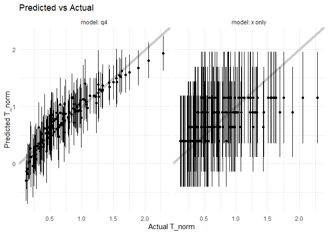
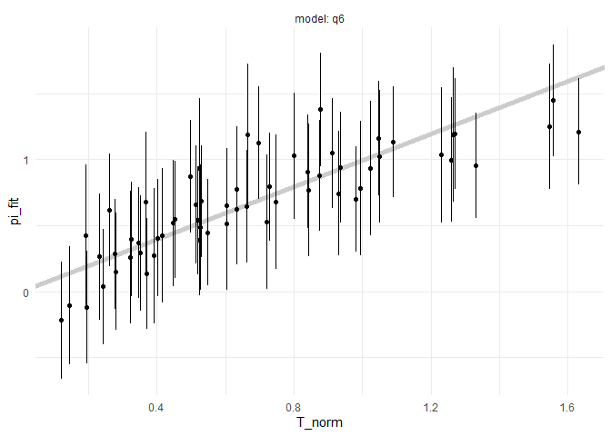

Regression Case Study: PSAAP II
================
Christopher Nie
2025-04-21

- [Grading Rubric](#grading-rubric)
  - [Individual](#individual)
  - [Submission](#submission)
- [Orientation: Exploring Simulation
  Results](#orientation-exploring-simulation-results)
  - [**q1** Perform your “initial checks” to get a sense of the
    data.](#q1-perform-your-initial-checks-to-get-a-sense-of-the-data)
  - [**q2** Visualize `T_norm` against `x`. Note that there are multiple
    simulations at different values of the Input variables: Each
    simulation result is identified by a different value of
    `idx`.](#q2-visualize-t_norm-against-x-note-that-there-are-multiple-simulations-at-different-values-of-the-input-variables-each-simulation-result-is-identified-by-a-different-value-of-idx)
  - [Modeling](#modeling)
    - [**q3** The following code chunk fits a few different models.
      Compute a measure of model accuracy for each model on
      `df_validate`, and compare their
      performance.](#q3-the-following-code-chunk-fits-a-few-different-models-compute-a-measure-of-model-accuracy-for-each-model-on-df_validate-and-compare-their-performance)
    - [**q4** Interpret this model](#q4-interpret-this-model)
  - [Contrasting CI and PI](#contrasting-ci-and-pi)
    - [**q5** The following code will construct a predicted-vs-actual
      plot with your model from *q4* and add prediction intervals. Study
      the results and answer the questions below under
      *observations*.](#q5-the-following-code-will-construct-a-predicted-vs-actual-plot-with-your-model-from-q4-and-add-prediction-intervals-study-the-results-and-answer-the-questions-below-under-observations)
- [Case Study: Predicting Performance
  Ranges](#case-study-predicting-performance-ranges)
  - [**q6** You are consulting with a team that is designing a prototype
    heat transfer device. They are asking you to help determine a
    *dependable range of values* for `T_norm` they can design around for
    this *single prototype*. The realized value of `T_norm` must not be
    too high as it may damage the downstream equipment, but it must also
    be high enough to extract an acceptable amount of
    heat.](#q6-you-are-consulting-with-a-team-that-is-designing-a-prototype-heat-transfer-device-they-are-asking-you-to-help-determine-a-dependable-range-of-values-for-t_norm-they-can-design-around-for-this-single-prototype-the-realized-value-of-t_norm-must-not-be-too-high-as-it-may-damage-the-downstream-equipment-but-it-must-also-be-high-enough-to-extract-an-acceptable-amount-of-heat)
- [References](#references)

*Purpose*: Confidence and prediction intervals are useful for studying
“pure sampling” of some distribution. However, we can combine CI and PI
with regression analysis to equip our modeling efforts with powerful
notions of uncertainty. In this challenge, you will use fluid simulation
data in a regression analysis with uncertainty quantification (CI and
PI) to support engineering design.

<!-- include-rubric -->

# Grading Rubric

<!-- -------------------------------------------------- -->

Unlike exercises, **challenges will be graded**. The following rubrics
define how you will be graded, both on an individual and team basis.

## Individual

<!-- ------------------------- -->

| Category | Needs Improvement | Satisfactory |
|----|----|----|
| Effort | Some task **q**’s left unattempted | All task **q**’s attempted |
| Observed | Did not document observations, or observations incorrect | Documented correct observations based on analysis |
| Supported | Some observations not clearly supported by analysis | All observations clearly supported by analysis (table, graph, etc.) |
| Assessed | Observations include claims not supported by the data, or reflect a level of certainty not warranted by the data | Observations are appropriately qualified by the quality & relevance of the data and (in)conclusiveness of the support |
| Specified | Uses the phrase “more data are necessary” without clarification | Any statement that “more data are necessary” specifies which *specific* data are needed to answer what *specific* question |
| Code Styled | Violations of the [style guide](https://style.tidyverse.org/) hinder readability | Code sufficiently close to the [style guide](https://style.tidyverse.org/) |

## Submission

<!-- ------------------------- -->

Make sure to commit both the challenge report (`report.md` file) and
supporting files (`report_files/` folder) when you are done! Then submit
a link to Canvas. **Your Challenge submission is not complete without
all files uploaded to GitHub.**

``` r
library(tidyverse)
```

    ## ── Attaching core tidyverse packages ──────────────────────── tidyverse 2.0.0 ──
    ## ✔ dplyr     1.1.4     ✔ readr     2.1.5
    ## ✔ forcats   1.0.0     ✔ stringr   1.5.1
    ## ✔ ggplot2   3.5.1     ✔ tibble    3.2.1
    ## ✔ lubridate 1.9.4     ✔ tidyr     1.3.1
    ## ✔ purrr     1.0.2     
    ## ── Conflicts ────────────────────────────────────────── tidyverse_conflicts() ──
    ## ✖ dplyr::filter() masks stats::filter()
    ## ✖ dplyr::lag()    masks stats::lag()
    ## ℹ Use the conflicted package (<http://conflicted.r-lib.org/>) to force all conflicts to become errors

``` r
library(modelr)
library(broom)
```

    ## 
    ## Attaching package: 'broom'
    ## 
    ## The following object is masked from 'package:modelr':
    ## 
    ##     bootstrap

``` r
## Helper function to compute uncertainty bounds
add_uncertainties <- function(data, model, prefix = "pred", ...) {
  df_fit <-
    stats::predict(model, data, ...) %>%
    as_tibble() %>%
    rename_with(~ str_c(prefix, "_", .))

  bind_cols(data, df_fit)
}
```

# Orientation: Exploring Simulation Results

*Background*: The data you will study in this exercise come from a
computational fluid dynamics (CFD) [simulation
campaign](https://www.sciencedirect.com/science/article/abs/pii/S0301932219308651?via%3Dihub)
that studied the interaction of turbulent flow and radiative heat
transfer to fluid-suspended particles\[1\]. These simulations were
carried out to help study a novel design of [solar
receiver](https://en.wikipedia.org/wiki/Concentrated_solar_power),
though they are more aimed at fundamental physics than detailed device
design. The following code chunk downloads and unpacks the data to your
local `./data/` folder.

``` r
## NOTE: No need to edit this chunk
## Download PSAAP II data and unzip
url_zip <- "https://ndownloader.figshare.com/files/24111269"
filename_zip <- "./data/psaap.zip"
filename_psaap <- "./data/psaap.csv"

curl::curl_download(url_zip, destfile = filename_zip)
unzip(filename_zip, exdir = "./data")
df_psaap <- read_csv(filename_psaap)
```

    ## Rows: 140 Columns: 22
    ## ── Column specification ────────────────────────────────────────────────────────
    ## Delimiter: ","
    ## dbl (22): x, idx, L, W, U_0, N_p, k_f, T_f, rho_f, mu_f, lam_f, C_fp, rho_p,...
    ## 
    ## ℹ Use `spec()` to retrieve the full column specification for this data.
    ## ℹ Specify the column types or set `show_col_types = FALSE` to quiet this message.

 Figure 1. An
example simulation, frozen at a specific point in time. An initial
simulation is run (HIT SECTION) to generate a turbulent flow with
particles, and that swirling flow is released into a rectangular domain
(RADIATED SECTION) with bulk downstream flow (left to right).
Concentrated solar radiation transmits through the optically transparent
fluid, but deposits heat into the particles. The particles then convect
heat into the fluid, which heats up the flow. The false-color image
shows the fluid temperature: Notice that there are “hot spots” where hot
particles have deposited heat into the fluid. The dataset `df_psaap`
gives measurements of `T_norm = (T - T0) / T0` averaged across planes at
various locations along the RADIATED SECTION.

### **q1** Perform your “initial checks” to get a sense of the data.

``` r
names(df_psaap)
```

    ##  [1] "x"      "idx"    "L"      "W"      "U_0"    "N_p"    "k_f"    "T_f"   
    ##  [9] "rho_f"  "mu_f"   "lam_f"  "C_fp"   "rho_p"  "d_p"    "C_pv"   "h"     
    ## [17] "I_0"    "eps_p"  "avg_q"  "avg_T"  "rms_T"  "T_norm"

``` r
glimpse(df_psaap)
```

    ## Rows: 140
    ## Columns: 22
    ## $ x      <dbl> 0.25, 0.25, 0.25, 0.25, 0.25, 0.25, 0.25, 0.25, 0.25, 0.25, 0.2…
    ## $ idx    <dbl> 1, 2, 3, 4, 5, 6, 7, 8, 9, 10, 11, 12, 13, 14, 15, 16, 17, 18, …
    ## $ L      <dbl> 0.1898058, 0.1511218, 0.1693629, 0.1348453, 0.2009348, 0.159982…
    ## $ W      <dbl> 0.03421154, 0.04636061, 0.03982547, 0.03252195, 0.04407102, 0.0…
    ## $ U_0    <dbl> 1.859988, 2.232010, 2.037526, 2.445058, 1.697920, 1.964563, 2.3…
    ## $ N_p    <dbl> 1600067, 2215857, 1707729, 2076161, 1945272, 1822635, 2364952, …
    ## $ k_f    <dbl> 0.08322124, 0.11122740, 0.08674231, 0.12083851, 0.09041236, 0.0…
    ## $ T_f    <dbl> 300.1695, 243.2194, 289.8267, 357.6900, 251.8989, 279.8404, 260…
    ## $ rho_f  <dbl> 1.1627025, 1.1319406, 1.1019925, 1.2267571, 1.4408823, 0.963726…
    ## $ mu_f   <dbl> 1.519285e-05, 1.840742e-05, 2.177345e-05, 2.230214e-05, 2.28436…
    ## $ lam_f  <dbl> 0.03158350, 0.02590530, 0.03487354, 0.03700987, 0.03557159, 0.0…
    ## $ C_fp   <dbl> 1062.3567, 1113.6519, 951.6687, 997.6194, 936.8270, 1223.7923, …
    ## $ rho_p  <dbl> 8415.812, 10648.082, 10805.811, 10965.876, 7819.270, 7372.629, …
    ## $ d_p    <dbl> 1.073764e-05, 1.100549e-05, 1.244840e-05, 9.729835e-06, 1.14198…
    ## $ C_pv   <dbl> 467.6986, 382.8730, 528.5409, 462.5276, 413.8601, 505.5510, 552…
    ## $ h      <dbl> 6279.242, 4666.593, 6147.515, 4920.612, 6018.550, 5356.113, 529…
    ## $ I_0    <dbl> 7876978, 6551358, 6121350, 6363488, 8512473, 7011572, 8268366, …
    ## $ eps_p  <dbl> 0.4426710, 0.3247988, 0.4027115, 0.3890929, 0.4388801, 0.336167…
    ## $ avg_q  <dbl> 689522.7, 684218.2, 619206.2, 1070186.0, 577245.1, 648248.9, 70…
    ## $ avg_T  <dbl> 485.0239, 291.3887, 401.6959, 447.3889, 392.5981, 401.3814, 360…
    ## $ rms_T  <dbl> 7.613507, 4.185764, 5.612525, 4.475737, 6.945722, 7.579457, 4.1…
    ## $ T_norm <dbl> 0.6158335, 0.1980487, 0.3859864, 0.2507726, 0.5585543, 0.434322…

**Observations**:

- There are 22 columns
- All columns are doubles

The important variables in this dataset are:

| Variable | Category | Meaning                           |
|----------|----------|-----------------------------------|
| `x`      | Spatial  | Channel location                  |
| `idx`    | Metadata | Simulation run                    |
| `L`      | Input    | Channel length                    |
| `W`      | Input    | Channel width                     |
| `U_0`    | Input    | Bulk velocity                     |
| `N_p`    | Input    | Number of particles               |
| `k_f`    | Input    | Turbulence level                  |
| `T_f`    | Input    | Fluid inlet temp                  |
| `rho_f`  | Input    | Fluid density                     |
| `mu_f`   | Input    | Fluid viscosity                   |
| `lam_f`  | Input    | Fluid conductivity                |
| `C_fp`   | Input    | Fluid isobaric heat capacity      |
| `rho_p`  | Input    | Particle density                  |
| `d_p`    | Input    | Particle diameter                 |
| `C_pv`   | Input    | Particle isochoric heat capacity  |
| `h`      | Input    | Convection coefficient            |
| `I_0`    | Input    | Radiation intensity               |
| `eps_p`  | Input    | Radiation absorption coefficient  |
| `avg_q`  | Output   | Plane-averaged heat flux          |
| `avg_T`  | Output   | Plane-averaged fluid temperature  |
| `rms_T`  | Output   | Plane-rms fluid temperature       |
| `T_norm` | Output   | Normalized fluid temperature rise |

The primary output of interest is `T_norm = (avg_T - T_f) / T_f`, the
normalized (dimensionless) temperature rise of the fluid, due to heat
transfer. These measurements are taken at locations `x` along a column
of fluid, for different experimental settings (e.g. different dimensions
`W, L`, different flow speeds `U_0`, etc.).

### **q2** Visualize `T_norm` against `x`. Note that there are multiple simulations at different values of the Input variables: Each simulation result is identified by a different value of `idx`.

``` r
## TODO: Visualize the data in df_psaap with T_norm against x;
##       design your visual to handle the multiple simulations,
##       each identified by different values of idx
ggplot(df_psaap, aes(x = x, y = T_norm, color = factor(idx))) +
  geom_line() + 
  labs(
    x = 'x',
    y = 'T_norm',
    color = 'Simulation ID'
  )
```

<!-- -->

## Modeling

The following chunk will split the data into training and validation
sets.

``` r
## NOTE: No need to edit this chunk
# Addl' Note: These data are already randomized by idx; no need
# to additionally shuffle the data!
df_train <- df_psaap %>% filter(idx %in% 1:20)
df_validate <- df_psaap %>% filter(idx %in% 21:36)
```

One of the key decisions we must make in modeling is choosing predictors
(features) from our observations to include in the model. Ideally we
should have some intuition for why these predictors are reasonable to
include in the model; for instance, we saw above that location along the
flow `x` tends to affect the temperature rise `T_norm`. This is because
fluid downstream has been exposed to solar radiation for longer, and
thus is likely to be at a higher temperature.

Reasoning about our variables—at least at a *high level*—can help us to
avoid including *fallacious* predictors in our models. You’ll explore
this idea in the next task.

### **q3** The following code chunk fits a few different models. Compute a measure of model accuracy for each model on `df_validate`, and compare their performance.

``` r
## NOTE: No need to edit these models
fit_baseline <- 
  df_train %>% 
  lm(formula = T_norm ~ x)

fit_cheat <- 
  df_train %>% 
  lm(formula = T_norm ~ avg_T)

fit_nonphysical <- 
  df_train %>% 
  lm(formula = T_norm ~ idx)

## TODO: Compute a measure of accuracy for each fit above;
##       compare their relative performance
df_q3 <- select(df_validate, x,idx,T_norm)
df_q3$predict_T_norm_baseline <- predict(fit_baseline, newdata = df_validate)
df_q3$predict_T_norm_cheat <- predict(fit_cheat, newdata = df_validate)
df_q3$predict_T_norm_nonphysical <- predict(fit_nonphysical, newdata = df_validate)
df_q3 <- select(df_q3, -x, -idx)

df_q3$r2_T_norm_baseline <- cor(df_q3$T_norm, df_q3$predict_T_norm_baseline)^2
df_q3$r2_T_norm_cheat <- cor(df_q3$T_norm, df_q3$predict_T_norm_cheat)^2
df_q3$r2_T_norm_nonphysical <- cor(df_q3$T_norm, df_q3$predict_T_norm_nonphysical)^2
df_q3a <- df_q3 %>% 
  select(c(5:7)) %>% 
  head(1)
df_q3a
```

    ## # A tibble: 1 × 3
    ##   r2_T_norm_baseline r2_T_norm_cheat r2_T_norm_nonphysical
    ##                <dbl>           <dbl>                 <dbl>
    ## 1              0.479           0.690               0.00200

**Observations**:

- Which model is *most accurate*? Which is *least accurate*?
  - I used $r^2$ as my measure of model accuracy.
    - The `fit_cheat` model is most accurate.
    - The `fit_nonphysical` is least accurate
- What *Category* of variable is `avg_T`? Why is it such an effective
  predictor?
  - As a mean, `avg_T` allows the model to ignore the variations due to
    plane differences. It is an output, which is also why it is so
    effective as a predictor.
- Would we have access to `avg_T` if we were trying to predict a *new*
  value of `T_norm`? Is `avg_T` a valid predictor?
  - Since `avg_T` is itself an output of the system, then we cannot use
    it to predict `T_norm`. Instead, we would have to use one of the
    other models, such as `fit_baseline` and `fit_nonphysical`, which
    use an input to the system.
- What *Category* of variable is `idx`? Does it have any physical
  meaning?
  - `idx` is an identifier attached to an experiment. It does not have
    any actual physical meaning.

### **q4** Interpret this model

Interpret the following model by answering the questions below.

*Note*. The `-` syntax in R formulas allows us to exclude columns from
fitting. So `T_norm ~ . - x` would fit on all columns *except* `x`.

``` r
## TODO: Inspect the regression coefficients for the following model
fit_q4 <- 
  df_train %>% 
  lm(formula = T_norm ~ . - idx - avg_q - avg_T - rms_T)
  # lm(formula = T_norm ~ L + W + U_0 + N_p + k_f + T_f)
  # lm(formula = T_norm ~ L - W - U_0 - N_p - k_f - T_f)

fit_q4
```

    ## 
    ## Call:
    ## lm(formula = T_norm ~ . - idx - avg_q - avg_T - rms_T, data = .)
    ## 
    ## Coefficients:
    ## (Intercept)            x            L            W          U_0          N_p  
    ##  -3.033e-03    1.018e+00    3.961e+00   -3.715e+01   -3.257e-01    2.723e-07  
    ##         k_f          T_f        rho_f         mu_f        lam_f         C_fp  
    ##   2.547e+00   -3.791e-04   -5.616e-01   -8.254e+03   -4.679e+00   -6.592e-04  
    ##       rho_p          d_p         C_pv            h          I_0        eps_p  
    ##   5.640e-06    1.236e+05   -7.243e-04    1.407e-06    1.600e-07    1.107e+00

``` r
sd(df_psaap$T_f)
```

    ## [1] 38.94204

**Observations**:

- Which columns are excluded in the model formula above? What categories
  do these belong to? Why are these important quantities to leave out of
  the model?
  - (model 1) exclude `idx`, `avg_q`, `avg_T`, `rms_T`
  - (model 2) exclude everything except `L`, `W`, `U_0`, `N_p`, `k_f`,
    `T_f`
  - (model 3) exclude everything except `L`
- Which inputs are *statistically significant*, according to the model?
  - `x`, `L`, `W`, `k_f`, `T_f` , `mu_f`, `lam_f`, `d_p`, `eps_p`
- What is the regression coefficient for `x`? What about the regression
  coefficient for `T_f`?
  - `x`: $1.081$
  - `T_f`: $3.79\times10^{-4}$
- What is the standard deviation of `x` in `df_psaap`? What about the
  standard deviation of `T_f`?
  - `x`: .28
  - `T_f`: 38.94204
- How do these standard deviations relate to the regression coefficients
  for `x` and `T_f`?
  - `x`, which has a small standard deviation, has a regression
    coefficient of ~1. `T_f`, which has a large standard deviation, has
    a regression coefficient in the magnitude of $10^{-4}$ . Although
    this is not enough to say that regression coefficient and standard
    deviation are related, we can see that a larger standard deviation
    may make the output less reliant on that particular input, hence the
    smaller regression coefficient.
- Note that literally *all* of the inputs above have *some* effect on
  the output `T_norm`; so they are all “significant” in that sense. What
  does this tell us about the limitations of statistical significance
  for interpreting regression coefficients?
  - Statistical significance lets us see which factors are most
    important. Despite this, all factors impact the final output. When
    choosing our model, it is important to consider whether the impact
    is worth keeping in the model.

## Contrasting CI and PI

Let’s revisit the ideas of confidence intervals (CI) and prediction
intervals (PI). Let’s fit a very simple model to these data, one which
only considers the channel location and ignores all other inputs. We’ll
also use the helper function `add_uncertainties()` (defined in the
`setup` chunk above) to add approximate CI and PI to the linear model.

``` r
## NOTE: No need to edit this chunk
fit_simple <-
  df_train %>%
  lm(data = ., formula = T_norm ~ x)

df_intervals <-
  df_train %>%
  add_uncertainties(fit_simple, interval = "confidence", prefix = "ci") %>%
  add_uncertainties(fit_simple, interval = "prediction", prefix = "pi")
```

The following figure visualizes the regression CI and PI against the
objects they are attempting to capture:

``` r
## NOTE: No need to edit this chunk
df_intervals %>%
  select(T_norm, x, matches("ci|pi")) %>%
  pivot_longer(
    names_to = c("method", ".value"),
    names_sep = "_",
    cols = matches("ci|pi")
  ) %>%

  ggplot(aes(x, fit)) +
  geom_errorbar(
    aes(ymin = lwr, ymax = upr, color = method),
    width = 0.05,
    size = 1
  ) +
  geom_smooth(
    data = df_psaap %>% mutate(method = "ci"),
    mapping = aes(x, T_norm),
    se = FALSE,
    linetype = 2,
    color = "black"
   ) +
  geom_point(
    data = df_validate %>% mutate(method = "pi"),
    mapping = aes(x, T_norm),
    size = 0.5
  ) +

  facet_grid(~method) +
  theme_minimal() +
  labs(
    x = "Channel Location (-)",
    y = "Normalized Temperature Rise (-)"
  )
```

    ## Warning: Using `size` aesthetic for lines was deprecated in ggplot2 3.4.0.
    ## ℹ Please use `linewidth` instead.
    ## This warning is displayed once every 8 hours.
    ## Call `lifecycle::last_lifecycle_warnings()` to see where this warning was
    ## generated.

    ## `geom_smooth()` using method = 'loess' and formula = 'y ~ x'

    ## Warning in simpleLoess(y, x, w, span, degree = degree, parametric = parametric,
    ## : pseudoinverse used at 0.24625

    ## Warning in simpleLoess(y, x, w, span, degree = degree, parametric = parametric,
    ## : neighborhood radius 0.50375

    ## Warning in simpleLoess(y, x, w, span, degree = degree, parametric = parametric,
    ## : reciprocal condition number 7.4302e-16

    ## Warning in simpleLoess(y, x, w, span, degree = degree, parametric = parametric,
    ## : There are other near singularities as well. 0.25376

<!-- -->

Under the `ci` facet we have the regression confidence intervals and the
mean trend (computed with all the data `df_psaap`). Under the `pi` facet
we have the regression prediction intervals and the `df_validation`
observations.

**Punchline**:

- Confidence intervals are meant to capture the *mean trend*
- Prediction intervals are meant to capture *new observations*

Both CI and PI are a quantification of the uncertainty in our model, but
the two intervals designed to answer different questions.

Since CI and PI are a quantification of uncertainty, they should tend to
*narrow* as our model becomes more confident in its predictions.
Building a more accurate model will often lead to a reduction in
uncertainty. We’ll see this phenomenon in action with the following
task:

### **q5** The following code will construct a predicted-vs-actual plot with your model from *q4* and add prediction intervals. Study the results and answer the questions below under *observations*.

``` r
## TODO: Run this code and interpret the results
## NOTE: No need to edit this chunk
## NOTE: This chunk will use your model from q4; it will predict on the
##       validation data, add prediction intervals for every prediction,
##       and visualize the results on a predicted-vs-actual plot. It will
##       also compare against the simple `fit_simple` defined above.
bind_rows(
  df_psaap %>% 
    add_uncertainties(fit_simple, interval = "prediction", prefix = "pi") %>% 
    select(T_norm, pi_lwr, pi_fit, pi_upr) %>% 
    mutate(model = "x only"),
  df_psaap %>% 
    add_uncertainties(fit_q4, interval = "prediction", prefix = "pi") %>% 
    select(T_norm, pi_lwr, pi_fit, pi_upr) %>% 
    mutate(model = "q4"),
) %>% 
  
  ggplot(aes(T_norm, pi_fit)) +
  geom_abline(slope = 1, intercept = 0, color = "grey80", size = 2) +
  geom_errorbar(
    aes(ymin = pi_lwr, ymax = pi_upr),
    width = 0
  ) +
  geom_point() +
  
  facet_grid(~ model, labeller = label_both) +
  theme_minimal() +
  labs(
    title = "Predicted vs Actual",
    x = "Actual T_norm",
    y = "Predicted T_norm"
  )
```

<!-- -->

**Observations**:

- Which model tends to be more accurate? How can you tell from this
  predicted-vs-actual plot?
  - The `q4` model is more accurate. We can see that the points follow
    the `Actual T_norm vs. Predicted T_norm` pretty well. Meanwhile, the
    `x only` model generally increases, but does not do so as accuratley
    as the `q4` model.
- Which model tends to be *more confident* in its predictions? Put
  differently, which model has *narrower prediction intervals*?
  - The `q4` model is more confident. the prediction intervals are more
    narrow.
- How many predictors does the `fit_simple` model need in order to make
  a prediction? What about your model `fit_q4`?
  - `fit_simple` has a single predictor – `x`, while my `fit_q4` has 17
    predictors.

Based on these results, you might be tempted to always throw every
reasonable variable into the model. For some cases, that might be the
best choice. However, some variables might be *outside our control*; for
example, variables involving human behavior cannot be fully under our
control. Other variables may be *too difficult to measure*; for example,
it is *in theory* possible to predict the strength of a component by
having detailed knowledge of its microstructure. However, it is
*patently infeasible* to do a detailed study of *every single component*
that gets used in an airplane.

In both cases—human behavior and variable material properties—we would
be better off treating those quantities as random variables. There are
at least two ways we could treat these factors: 1. Explicitly model some
inputs as random variables and construct a model that *propagates* that
uncertainty from inputs to outputs, or 2. Implicitly model the
uncontrolled the uncontrolled variables by not including them as
predictors in the model, and instead relying on the error term
$\epsilon$ to represent these unaccounted factors. You will pursue
strategy 2. in the following Case Study.

# Case Study: Predicting Performance Ranges

### **q6** You are consulting with a team that is designing a prototype heat transfer device. They are asking you to help determine a *dependable range of values* for `T_norm` they can design around for this *single prototype*. The realized value of `T_norm` must not be too high as it may damage the downstream equipment, but it must also be high enough to extract an acceptable amount of heat.

In order to maximize the conditions under which this device can operate
successfully, the design team has chosen to fix the variables listed in
the table below, and consider the other variables to fluctuate according
to the values observed in `df_psaap`.

| Variable | Value    |
|----------|----------|
| `x`      | 1.0      |
| `L`      | 0.2      |
| `W`      | 0.04     |
| `U_0`    | 1.0      |
| (Other)  | (Varies) |

Your task is to use a regression analysis to deliver to the design team
a *dependable range* of values for `T_norm`, given their proposed
design, and at a fairly high level `0.8`. Perform your analysis below
(use the helper function `add_uncertainties()` with the `level`
argument!), and answer the questions below.

*Hint*: This problem will require you to *build a model* by choosing the
appropriate variables to include in the analysis. Think about *which
variables the design team can control*, and *which variables they have
chosen to allow to vary*. You will also need to choose between computing
a CI or PI for the design prediction.

|         |       |                  |
|---------|-------|------------------|
| `T_f`   | Input | Fluid inlet temp |
| `rho_f` | Input | Fluid density    |
| `mu_f`  | Input | Fluid viscosity  |

  

``` r
# NOTE: No need to change df_design; this is the target the client
#       is considering
df_design <- tibble(x = 1, L = 0.2, W = 0.04, U_0 = 1.0)
# NOTE: This is the level the "probability" level customer wants
pr_level <- 0.8

## TODO: Fit a model, assess the uncertainty in your prediction, 
#        use the validation data to check your uncertainty estimates, and 
#        make a recommendation on a *dependable range* of values for T_norm
#        at the point `df_design`
fit_q6 <- 
  df_train %>%    
  lm(formula = T_norm ~ x + L + W + U_0 + N_p + k_f + T_f + I_0 + rho_f + mu_f)

df_intervals <-
  df_train %>%
  add_uncertainties(fit_q6, interval = "confidence", prefix = "ci") %>%
  add_uncertainties(fit_q6, interval = "prediction", prefix = "pi")


bind_rows(
  df_validate %>% 
    add_uncertainties(fit_q6, interval = "prediction", prefix = "pi") %>% 
    select(T_norm, pi_lwr, pi_fit, pi_upr) %>% 
    mutate(model = "q6")) %>% 
    ggplot(aes(T_norm, pi_fit)) +
  geom_abline(slope = 1, intercept = 0, color = "grey80", size = 2) +
  geom_errorbar(
    aes(ymin = pi_lwr, ymax = pi_upr),
    width = 0
  ) +
  geom_point() +
  
  facet_grid(~ model, labeller = label_both) +
  theme_minimal()
```

<!-- -->

``` r
rsquare(fit_q6, df_train)
```

    ## [1] 0.8663256

``` r
rsquare(fit_q6, df_validate)
```

    ## [1] 0.682321

``` r
intervals_q6 <-
  df_validate %>% 
  add_uncertainties(
    fit_q6, 
    interval = "prediction", 
    prefix = "pi", 
    level = pr_level)

mean(intervals_q6$pi_lwr <= df_validate$T_norm & df_validate$T_norm <= intervals_q6$pi_upr)
```

    ## [1] 0.8166667

``` r
df_design_real <- 
  df_psaap %>% 
  filter(x==1,
         abs(L-.2)<.01,
         abs(W-.04)<.01)

df_design_real
```

    ## # A tibble: 4 × 22
    ##       x   idx     L      W   U_0     N_p    k_f   T_f rho_f    mu_f  lam_f  C_fp
    ##   <dbl> <dbl> <dbl>  <dbl> <dbl>   <dbl>  <dbl> <dbl> <dbl>   <dbl>  <dbl> <dbl>
    ## 1     1     5 0.201 0.0441  1.70  1.95e6 0.0904  252.  1.44 2.28e-5 0.0356  937.
    ## 2     1    13 0.195 0.0320  2.00  1.79e6 0.111   311.  1.48 2.08e-5 0.0264 1096.
    ## 3     1    21 0.198 0.0405  1.89  2.26e6 0.0939  269.  1.23 1.85e-5 0.0363 1263.
    ## 4     1    29 0.193 0.0469  2.43  1.62e6 0.105   291.  1.37 1.80e-5 0.0253  880.
    ## # ℹ 10 more variables: rho_p <dbl>, d_p <dbl>, C_pv <dbl>, h <dbl>, I_0 <dbl>,
    ## #   eps_p <dbl>, avg_q <dbl>, avg_T <dbl>, rms_T <dbl>, T_norm <dbl>

``` r
summary(df_validate$T_norm)
```

    ##    Min. 1st Qu.  Median    Mean 3rd Qu.    Max. 
    ##  0.1215  0.3859  0.6181  0.6879  0.9307  1.6301

``` r
summary(df_train$T_norm)
```

    ##    Min. 1st Qu.  Median    Mean 3rd Qu.    Max. 
    ##  0.1250  0.3889  0.6488  0.7721  1.0062  2.2840

**Recommendation**:

- How much do you trust your model? Why?
  - This model has a .83 rsquared value for the training set, but a .82
    rsquared value for the validation set.
  - 68% of the validation cases lie within the intervals. Thus, I am not
    sure I can trust this for this use case.
- What kind of interval—confidence or prediction—would you use for this
  task, and why?
  - Because of the high amount of uncertainty, I believe that the
    prediction interval is more fit for this example. Furthermore, we
    are predicting individual events. As such, it is more appropriate to
    use the prediction interval, as confidence intervals are more
    applicable when studying population parameters where the mean is
    applicable.
- What fraction of validation cases lie within the intervals you
  predict? (NB. Make sure to calculate your intervals *based on the
  validation data*; don’t just use one single interval!) How does this
  compare with `pr_level`?
  - 68% of validation cases lie within the intervals
- What interval for `T_norm` would you recommend the design team to plan
  around?
  - The lower quartiles for both `df_validate` and `df_train` are
    ~.3889, while the upper quartiles lie ~1. Thus, that would be the
    recommendation for the design team.
- Are there any other recommendations you would provide?
  - I assumed quite a bit of uncontrollable variables, such as various
    coefficients such as heat capacity and heat coefficient. Perhaps if
    these were included, then we can reach a higher accuracy.
  - I would also probably notify that their design requirements (to a
    precision of .01 units \[mm?\]) were only covered under four of the
    140 test points. Thus, it would not be feasible to have a high
    degree of certainty for their design choice.
  - Furthermore, I could not discover any data points where `U_0` was 1,
    which was in their design requirements.

*Bonus*: One way you could take this analysis further is to recommend
which other variables the design team should tightly control. You could
do this by fixing values in `df_design` and adding them to the model. An
exercise you could carry out would be to systematically test the
variables to see which ones the design team should more tightly control.

# References

- \[1\] Jofre, del Rosario, and Iaccarino “Data-driven dimensional
  analysis of heat transfer in irradiated particle-laden turbulent
  flow” (2020) *International Journal of Multiphase Flow*,
  <https://doi.org/10.1016/j.ijmultiphaseflow.2019.103198>
