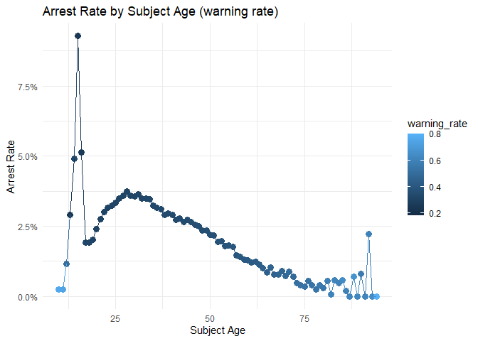
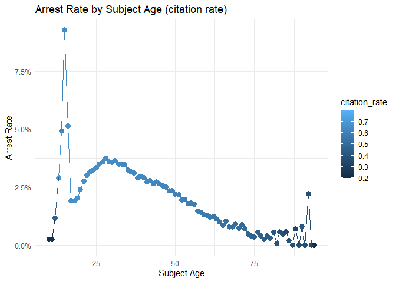
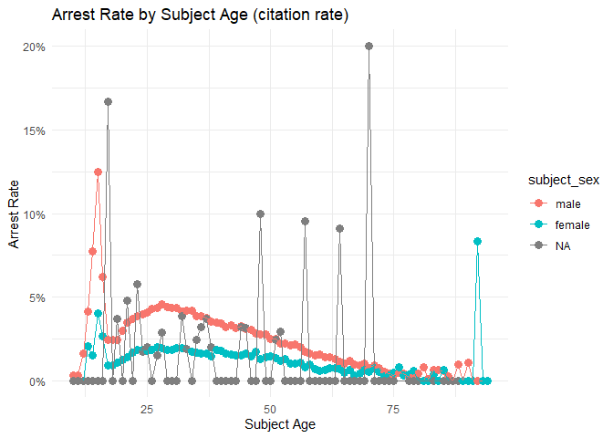
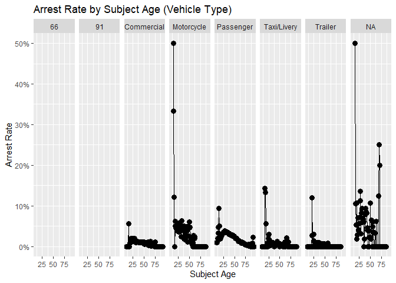
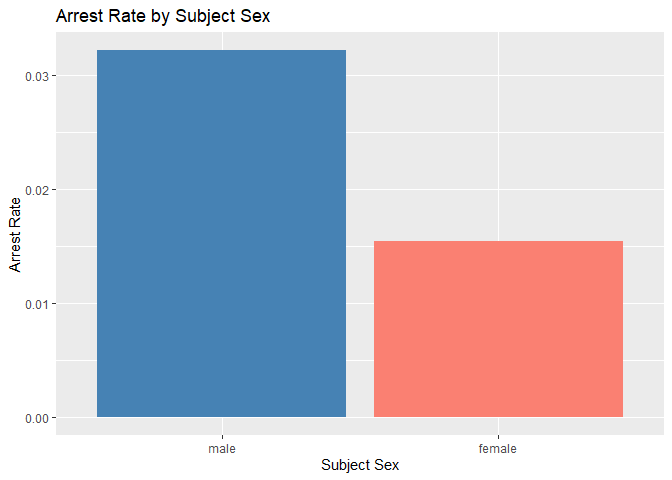
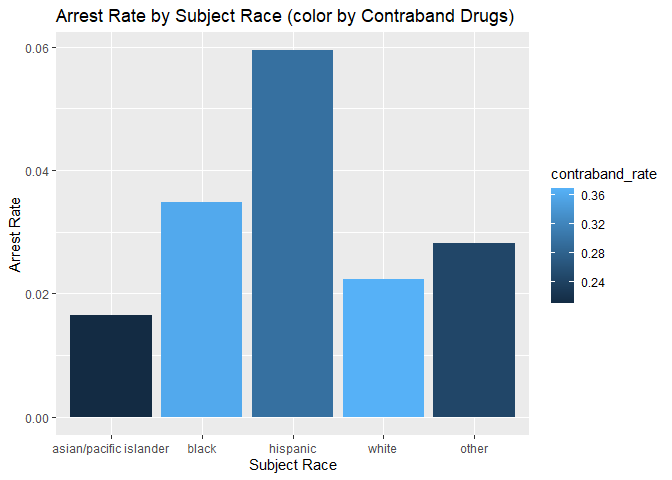

Massachusetts Highway Stops
================
Christopher Nie
2025-04-27

- [Grading Rubric](#grading-rubric)
  - [Individual](#individual)
  - [Submission](#submission)
- [Setup](#setup)
  - [**q1** Go to the Stanford Open Policing Project page and download
    the Massachusetts State Police records in `Rds` format. Move the
    data to your `data` folder and match the `filename` to load the
    data.](#q1-go-to-the-stanford-open-policing-project-page-and-download-the-massachusetts-state-police-records-in-rds-format-move-the-data-to-your-data-folder-and-match-the-filename-to-load-the-data)
- [EDA](#eda)
  - [**q2** Do your “first checks” on the dataset. What are the basic
    facts about this
    dataset?](#q2-do-your-first-checks-on-the-dataset-what-are-the-basic-facts-about-this-dataset)
  - [**q3** Check the set of factor levels for `subject_race` and
    `raw_Race`. What do you note about overlap / difference between the
    two
    sets?](#q3-check-the-set-of-factor-levels-for-subject_race-and-raw_race-what-do-you-note-about-overlap--difference-between-the-two-sets)
  - [**q4** Check whether `subject_race` and `raw_Race` match for a
    large fraction of cases. Which of the two hypotheses above is most
    likely, based on your
    results?](#q4-check-whether-subject_race-and-raw_race-match-for-a-large-fraction-of-cases-which-of-the-two-hypotheses-above-is-most-likely-based-on-your-results)
  - [Vis](#vis)
    - [**q5** Compare the *arrest rate*—the fraction of total cases in
      which the subject was arrested—across different factors. Create as
      many visuals (or tables) as you need, but make sure to check the
      trends across all of the `subject` variables. Answer the questions
      under *observations*
      below.](#q5-compare-the-arrest-ratethe-fraction-of-total-cases-in-which-the-subject-was-arrestedacross-different-factors-create-as-many-visuals-or-tables-as-you-need-but-make-sure-to-check-the-trends-across-all-of-the-subject-variables-answer-the-questions-under-observations-below)
- [Modeling](#modeling)
  - [**q6** Run the following code and interpret the regression
    coefficients. Answer the the questions under *observations*
    below.](#q6-run-the-following-code-and-interpret-the-regression-coefficients-answer-the-the-questions-under-observations-below)
  - [**q7** Re-fit the logistic regression from q6 setting `"white"` as
    the reference level for `subject_race`. Interpret the the model
    terms and answer the questions
    below.](#q7-re-fit-the-logistic-regression-from-q6-setting-white-as-the-reference-level-for-subject_race-interpret-the-the-model-terms-and-answer-the-questions-below)
  - [**q8** Re-fit the model using a factor indicating the presence of
    contraband in the subject’s vehicle. Answer the questions under
    *observations*
    below.](#q8-re-fit-the-model-using-a-factor-indicating-the-presence-of-contraband-in-the-subjects-vehicle-answer-the-questions-under-observations-below)
  - [**q9** Go deeper: Pose at least one more question about the data
    and fit at least one more model in support of answering that
    question.](#q9-go-deeper-pose-at-least-one-more-question-about-the-data-and-fit-at-least-one-more-model-in-support-of-answering-that-question)
  - [Further Reading](#further-reading)

*Purpose*: In this last challenge we’ll focus on using logistic
regression to study a large, complicated dataset. Interpreting the
results of a model can be challenging—both in terms of the statistics
and the real-world reasoning—so we’ll get some practice in this
challenge.

<!-- include-rubric -->

# Grading Rubric

<!-- -------------------------------------------------- -->

Unlike exercises, **challenges will be graded**. The following rubrics
define how you will be graded, both on an individual and team basis.

## Individual

<!-- ------------------------- -->

| Category | Needs Improvement | Satisfactory |
|----|----|----|
| Effort | Some task **q**’s left unattempted | All task **q**’s attempted |
| Observed | Did not document observations, or observations incorrect | Documented correct observations based on analysis |
| Supported | Some observations not clearly supported by analysis | All observations clearly supported by analysis (table, graph, etc.) |
| Assessed | Observations include claims not supported by the data, or reflect a level of certainty not warranted by the data | Observations are appropriately qualified by the quality & relevance of the data and (in)conclusiveness of the support |
| Specified | Uses the phrase “more data are necessary” without clarification | Any statement that “more data are necessary” specifies which *specific* data are needed to answer what *specific* question |
| Code Styled | Violations of the [style guide](https://style.tidyverse.org/) hinder readability | Code sufficiently close to the [style guide](https://style.tidyverse.org/) |

## Submission

<!-- ------------------------- -->

Make sure to commit both the challenge report (`report.md` file) and
supporting files (`report_files/` folder) when you are done! Then submit
a link to Canvas. **Your Challenge submission is not complete without
all files uploaded to GitHub.**

*Background*: We’ll study data from the [Stanford Open Policing
Project](https://openpolicing.stanford.edu/data/), specifically their
dataset on Massachusetts State Patrol police stops.

``` r
library(tidyverse)
```

    ## ── Attaching core tidyverse packages ──────────────────────── tidyverse 2.0.0 ──
    ## ✔ dplyr     1.1.4     ✔ readr     2.1.5
    ## ✔ forcats   1.0.0     ✔ stringr   1.5.1
    ## ✔ ggplot2   3.5.1     ✔ tibble    3.2.1
    ## ✔ lubridate 1.9.4     ✔ tidyr     1.3.1
    ## ✔ purrr     1.0.2     
    ## ── Conflicts ────────────────────────────────────────── tidyverse_conflicts() ──
    ## ✖ dplyr::filter() masks stats::filter()
    ## ✖ dplyr::lag()    masks stats::lag()
    ## ℹ Use the conflicted package (<http://conflicted.r-lib.org/>) to force all conflicts to become errors

``` r
library(broom)
```

# Setup

<!-- -------------------------------------------------- -->

### **q1** Go to the [Stanford Open Policing Project](https://openpolicing.stanford.edu/data/) page and download the Massachusetts State Police records in `Rds` format. Move the data to your `data` folder and match the `filename` to load the data.

*Note*: An `Rds` file is an R-specific file format. The function
`readRDS` will read these files.

``` r
## TODO: Download the data, move to your data folder, and load it
filename <- "./data/yg821jf8611_ma_statewide_2020_04_01.rds"
df_data <- readRDS(filename)
```

# EDA

<!-- -------------------------------------------------- -->

``` r
glimpse(df_data)
```

    ## Rows: 3,416,238
    ## Columns: 24
    ## $ raw_row_number             <chr> "1", "2", "3", "4", "5", "6", "7", "8", "9"…
    ## $ date                       <date> 2007-06-06, 2007-06-07, 2007-06-07, 2007-0…
    ## $ location                   <chr> "MIDDLEBOROUGH", "SEEKONK", "MEDFORD", "MED…
    ## $ county_name                <chr> "Plymouth County", "Bristol County", "Middl…
    ## $ subject_age                <int> 33, 36, 56, 37, 22, 34, 54, 31, 21, 56, 56,…
    ## $ subject_race               <fct> white, white, white, white, hispanic, white…
    ## $ subject_sex                <fct> male, male, female, male, female, male, mal…
    ## $ type                       <fct> vehicular, vehicular, vehicular, vehicular,…
    ## $ arrest_made                <lgl> FALSE, FALSE, FALSE, FALSE, FALSE, FALSE, F…
    ## $ citation_issued            <lgl> TRUE, FALSE, FALSE, FALSE, TRUE, TRUE, TRUE…
    ## $ warning_issued             <lgl> FALSE, TRUE, TRUE, TRUE, FALSE, FALSE, FALS…
    ## $ outcome                    <fct> citation, warning, warning, warning, citati…
    ## $ contraband_found           <lgl> NA, FALSE, NA, NA, NA, NA, NA, NA, NA, NA, …
    ## $ contraband_drugs           <lgl> NA, FALSE, NA, NA, NA, NA, NA, NA, NA, NA, …
    ## $ contraband_weapons         <lgl> NA, FALSE, NA, NA, NA, NA, NA, NA, NA, NA, …
    ## $ contraband_alcohol         <lgl> FALSE, FALSE, FALSE, FALSE, FALSE, FALSE, F…
    ## $ contraband_other           <lgl> NA, FALSE, NA, NA, NA, NA, NA, NA, NA, NA, …
    ## $ frisk_performed            <lgl> NA, FALSE, NA, NA, NA, NA, NA, NA, NA, NA, …
    ## $ search_conducted           <lgl> FALSE, TRUE, FALSE, FALSE, FALSE, FALSE, FA…
    ## $ search_basis               <fct> NA, other, NA, NA, NA, NA, NA, NA, NA, NA, …
    ## $ reason_for_stop            <chr> "Speed", NA, NA, NA, NA, "Speed", NA, NA, N…
    ## $ vehicle_type               <chr> "Passenger", "Commercial", "Passenger", "Co…
    ## $ vehicle_registration_state <fct> MA, MA, MA, MA, MA, MA, MA, MA, MA, MA, MA,…
    ## $ raw_Race                   <chr> "White", "White", "White", "White", "Hispan…

``` r
head(df_data)
```

    ## # A tibble: 6 × 24
    ##   raw_row_number date       location      county_name   subject_age subject_race
    ##   <chr>          <date>     <chr>         <chr>               <int> <fct>       
    ## 1 1              2007-06-06 MIDDLEBOROUGH Plymouth Cou…          33 white       
    ## 2 2              2007-06-07 SEEKONK       Bristol Coun…          36 white       
    ## 3 3              2007-06-07 MEDFORD       Middlesex Co…          56 white       
    ## 4 4              2007-06-07 MEDFORD       Middlesex Co…          37 white       
    ## 5 5              2007-06-07 EVERETT       Middlesex Co…          22 hispanic    
    ## 6 6              2007-06-07 MEDFORD       Middlesex Co…          34 white       
    ## # ℹ 18 more variables: subject_sex <fct>, type <fct>, arrest_made <lgl>,
    ## #   citation_issued <lgl>, warning_issued <lgl>, outcome <fct>,
    ## #   contraband_found <lgl>, contraband_drugs <lgl>, contraband_weapons <lgl>,
    ## #   contraband_alcohol <lgl>, contraband_other <lgl>, frisk_performed <lgl>,
    ## #   search_conducted <lgl>, search_basis <fct>, reason_for_stop <chr>,
    ## #   vehicle_type <chr>, vehicle_registration_state <fct>, raw_Race <chr>

``` r
tail(df_data)
```

    ## # A tibble: 6 × 24
    ##   raw_row_number date       location    county_name     subject_age subject_race
    ##   <chr>          <date>     <chr>       <chr>                 <int> <fct>       
    ## 1 3418293        2015-12-16 RAYNHAM     Bristol County           21 white       
    ## 2 3418294        2015-12-22 DARTMOUTH   Bristol County           25 white       
    ## 3 3418295        2015-12-27 FALL RIVER  Bristol County           52 asian/pacif…
    ## 4 3418296        2015-01-06 NORTHAMPTON Hampshire Coun…          41 white       
    ## 5 3418297        2015-01-06 HOLYOKE     Hampden County           26 white       
    ## 6 3418298        2015-01-06 HOLYOKE     Hampden County           52 white       
    ## # ℹ 18 more variables: subject_sex <fct>, type <fct>, arrest_made <lgl>,
    ## #   citation_issued <lgl>, warning_issued <lgl>, outcome <fct>,
    ## #   contraband_found <lgl>, contraband_drugs <lgl>, contraband_weapons <lgl>,
    ## #   contraband_alcohol <lgl>, contraband_other <lgl>, frisk_performed <lgl>,
    ## #   search_conducted <lgl>, search_basis <fct>, reason_for_stop <chr>,
    ## #   vehicle_type <chr>, vehicle_registration_state <fct>, raw_Race <chr>

### **q2** Do your “first checks” on the dataset. What are the basic facts about this dataset?

**Observations**:

- What are the basic facts about this dataset?
- There is a lot of data
- 3.4 million rows
- Data taken between 2007 and 2015
- It looks like there are a lot of `NA` values.

Note that we have both a `subject_race` and `race_Raw` column. There are
a few possibilities as to what `race_Raw` represents:

- `race_Raw` could be the race of the police officer in the stop
- `race_Raw` could be an unprocessed version of `subject_race`

Let’s try to distinguish between these two possibilities.

### **q3** Check the set of factor levels for `subject_race` and `raw_Race`. What do you note about overlap / difference between the two sets?

``` r
df_data %>% 
  select(raw_Race, subject_race) %>% 
    glimpse()
```

    ## Rows: 3,416,238
    ## Columns: 2
    ## $ raw_Race     <chr> "White", "White", "White", "White", "Hispanic", "White", …
    ## $ subject_race <fct> white, white, white, white, hispanic, white, hispanic, hi…

``` r
unique(df_data$raw_Race)
```

    ## [1] "White"                                        
    ## [2] "Hispanic"                                     
    ## [3] "Black"                                        
    ## [4] "Asian or Pacific Islander"                    
    ## [5] "Middle Eastern or East Indian (South Asian)"  
    ## [6] "American Indian or Alaskan Native"            
    ## [7] NA                                             
    ## [8] "None - for no operator present citations only"
    ## [9] "A"

``` r
unique(df_data$subject_race)
```

    ## [1] white                  hispanic               black                 
    ## [4] asian/pacific islander other                  <NA>                  
    ## [7] unknown               
    ## Levels: asian/pacific islander black hispanic white other unknown

``` r
summary(df_data$raw_Race)
```

    ##    Length     Class      Mode 
    ##   3416238 character character

``` r
summary(df_data$subject_race)
```

    ## asian/pacific islander                  black               hispanic 
    ##                 166842                 351610                 338317 
    ##                  white                  other                unknown 
    ##                2529780                  11008                  17017 
    ##                   NA's 
    ##                   1664

**Observations**:

- What are the unique values for `subject_race`?
  - white, hispanic, black, asian/pacific islander, other, \<NA\>,
    unknown
- What are the unique values for `raw_Race`?
  - “White”, “Hispanic”, “Black”, “Asian or Pacific Islander”, “Middle
    Eastern or East Indian (South Asian)”, “American Indian or Alaskan
    Native”, NA, “None - for no operator present citations only”, “A”
- What is the overlap between the two sets?
  - Strictly speaking, there are no overlaps as it appears that they are
    not the same data type. `raw_Race` is a string vector, while
    `subject_race` is a factor vector
- What is the difference between the two sets?
  - They are different data types. Furthermore, it appears that
    `raw_Race` contains additional information, such as “Middle Eastern
    or East Indian (South Asian)” and “American Indian or Alaskan
    Native”

### **q4** Check whether `subject_race` and `raw_Race` match for a large fraction of cases. Which of the two hypotheses above is most likely, based on your results?

*Note*: Just to be clear, I’m *not* asking you to do a *statistical*
hypothesis test.

``` r
## TODO: Devise your own way to test the hypothesis posed above.
df_data %>% 
  mutate(raw_race_lower = tolower(raw_Race),
         match = raw_race_lower == as.character(subject_race)) %>%
  count(match)
```

    ## # A tibble: 3 × 2
    ##   match       n
    ##   <lgl>   <int>
    ## 1 FALSE  194867
    ## 2 TRUE  3219707
    ## 3 NA       1664

**Observations**

Between the two hypotheses:

- `race_Raw` could be the race of the police officer in the stop
- `race_Raw` could be an unprocessed version of `subject_race`

which is most plausible, based on your results?

- Since the match rate is so high, I believe that the second hypothesis
  is more plausible. There are about 16x more TRUE cases than FALSE
  cases. Thus, we might expect that the FALSE cases are simply due to
  situations when the `subject_race` is not simply the lowercase and
  character-converted `race_Raw`, some examples of these situations are
  “American Indian or Alaskan Native” and “Middle Eastern or East Indian
  (South Asian)”. This leans more to the unprocessed version hypothesis.

## Vis

<!-- ------------------------- -->

### **q5** Compare the *arrest rate*—the fraction of total cases in which the subject was arrested—across different factors. Create as many visuals (or tables) as you need, but make sure to check the trends across all of the `subject` variables. Answer the questions under *observations* below.

(Note: Create as many chunks and visuals as you need)

**Observations**:

``` r
df_data
```

    ## # A tibble: 3,416,238 × 24
    ##    raw_row_number date       location      county_name  subject_age subject_race
    ##    <chr>          <date>     <chr>         <chr>              <int> <fct>       
    ##  1 1              2007-06-06 MIDDLEBOROUGH Plymouth Co…          33 white       
    ##  2 2              2007-06-07 SEEKONK       Bristol Cou…          36 white       
    ##  3 3              2007-06-07 MEDFORD       Middlesex C…          56 white       
    ##  4 4              2007-06-07 MEDFORD       Middlesex C…          37 white       
    ##  5 5              2007-06-07 EVERETT       Middlesex C…          22 hispanic    
    ##  6 6              2007-06-07 MEDFORD       Middlesex C…          34 white       
    ##  7 7              2007-06-07 SOMERVILLE    Middlesex C…          54 hispanic    
    ##  8 8              2007-06-07 HOPKINTON     Middlesex C…          31 hispanic    
    ##  9 9              2007-06-07 SOMERVILLE    Middlesex C…          21 white       
    ## 10 10             2007-06-06 BARNSTABLE    Barnstable …          56 white       
    ## # ℹ 3,416,228 more rows
    ## # ℹ 18 more variables: subject_sex <fct>, type <fct>, arrest_made <lgl>,
    ## #   citation_issued <lgl>, warning_issued <lgl>, outcome <fct>,
    ## #   contraband_found <lgl>, contraband_drugs <lgl>, contraband_weapons <lgl>,
    ## #   contraband_alcohol <lgl>, contraband_other <lgl>, frisk_performed <lgl>,
    ## #   search_conducted <lgl>, search_basis <fct>, reason_for_stop <chr>,
    ## #   vehicle_type <chr>, vehicle_registration_state <fct>, raw_Race <chr>

``` r
# remove NA values
df_dataCleaned <- 
  df_data %>% 
  filter(!is.na(subject_age),
         !is.na(arrest_made), 
         !is.na(subject_sex), 
         !is.na(subject_race), 
         !is.na(vehicle_type))
# Graph Arrest Rate by Subject Age (color by warning rate)
df_dataCleaned %>% 
  group_by(subject_age) %>%
  summarise(arrest_rate = mean(arrest_made, na.rm = TRUE),
            warning_rate = mean(warning_issued, na.rm = TRUE)) %>%
  ggplot(aes(x = subject_age, y = arrest_rate, color = warning_rate)) +
  geom_point(size = 3) +
  geom_line() +
  scale_y_continuous(labels = scales::percent) +
  labs(title = "Arrest Rate by Subject Age (warning rate)",
       x = "Subject Age",
       y = "Arrest Rate") +
  theme_minimal()
```

<!-- -->

``` r
# Graph Arrest Rate by Subject Age (color by citation rate )
df_dataCleaned %>% 
  group_by(subject_age) %>%
  summarise(arrest_rate = mean(arrest_made, na.rm = TRUE),
            citation_rate = mean(citation_issued, na.rm = TRUE)) %>%
  ggplot(aes(x = subject_age, y = arrest_rate, color = citation_rate)) +
  geom_point(size = 3) +
  geom_line() +
  scale_y_continuous(labels = scales::percent) +
  labs(title = "Arrest Rate by Subject Age (citation rate)",
       x = "Subject Age",
       y = "Arrest Rate") +
  theme_minimal()
```

<!-- -->

``` r
# Graph Arrest Rate by Subject Age (color by subject sex )
df_dataCleaned %>% 
  group_by(subject_age, subject_sex) %>%
  summarise(arrest_rate = mean(arrest_made, na.rm = TRUE), .groups = "drop") %>%
  ggplot(aes(x = subject_age, y = arrest_rate, color = subject_sex)) +
  geom_point(size = 3) +
  geom_line() +
  scale_y_continuous(labels = scales::percent) +
  labs(title = "Arrest Rate by Subject Age (citation rate)",
       x = "Subject Age",
       y = "Arrest Rate") +
  theme_minimal()
```

<!-- -->

``` r
# Graph Arrest Rate by Subject Age (tacet by vehicle type)
df_dataCleaned %>% 
  group_by(subject_age, vehicle_type) %>% 
  summarise(arrest_rate = mean(arrest_made, na.rm = TRUE), .groups = "drop") %>%
  
  ggplot(aes(x = subject_age, y = arrest_rate)) +
  geom_point(size = 3) +
  geom_line() +
  scale_y_continuous(labels = scales::percent) +
  labs(title = "Arrest Rate by Subject Age (Vehicle Type)",
       x = "Subject Age",
       y = "Arrest Rate") +
  facet_wrap(~vehicle_type, nrow = 1)
```

<!-- -->

``` r
# Graph Age distribution of car stops
df_dataCleaned %>% 
  ggplot(aes(x = subject_age)) +
  geom_bar(fill = "steelblue") +
  labs(title = "Arrest Rate by Subject Age",
       x = "Subjec Age",
       y = "Arrest Rate")
```

<!-- -->

``` r
# Finding the "spike"
spike_data <- df_dataCleaned %>%
  group_by(subject_age) %>%
  summarise(
    total_stops = n(),                   
    total_arrests = sum(arrest_made),    
    arrest_rate = mean(arrest_made)      
  ) %>%
  arrange(desc(arrest_rate)) 


# View the top ages with highest arrest rates
head(spike_data, 10)
```

    ## # A tibble: 10 × 4
    ##    subject_age total_stops total_arrests arrest_rate
    ##          <int>       <int>         <int>       <dbl>
    ##  1          15         436            44      0.101 
    ##  2          14         247            15      0.0607
    ##  3          16        2040           104      0.0510
    ##  4          28      102960          3834      0.0372
    ##  5          31       86263          3135      0.0363
    ##  6          29       97369          3507      0.0360
    ##  7          27      107536          3849      0.0358
    ##  8          30       92495          3292      0.0356
    ##  9          13         170             6      0.0353
    ## 10          26      114406          4002      0.0350

- How does `arrest_rate` tend to vary with `subject_age`?
  - The Arrest Rate vs Subject Age has two peaks.
  - The first peak is at age 15. Presumably, this is because
    Massachusett’s minimum age of driving is 16. Thus, anything lower
    might just straight up be illegal (although it looks like some of
    the extreme ages have higher warning rates). Additionally, the
    sample size at this age group is very small. Thus, even a single
    arrest may change the percentage drastically. For reference, there
    are ~436 15-year olds stopped, while there are ~2040 16-year olds
    stopped. Only 44 15 year-olds were arrested, while 105 16-year olds
    were arrested. However, because of the sample size difference, the
    percentage is much bigger.
  - The second peak is at age 28.
  - The two peak arrest rates also had the most citation rates.
  - The peaks appear regardless of sex
  - We can see that vehicle type actually matters a lot with respect to
    the peaks.

``` r
df_dataCleaned %>% 
  group_by(subject_sex) %>% 
  summarise(arrest_rate = mean(arrest_made, na.rm = TRUE)) %>%
  ggplot(aes(x = subject_sex, y = arrest_rate)) +
  geom_col(fill = c("male" = "steelblue", "female" = "salmon")) + 
  labs(title = "Arrest Rate by Subject Sex",
       x = "Subject Sex",
       y = "Arrest Rate")
```

<!-- -->

``` r
# Graph Age distribution of car stops
df_dataCleaned %>% 
  ggplot(aes(x = subject_sex)) +
  geom_bar(fill = c("male" = "steelblue", "female" = "salmon")) +
  labs(title = "Car stop Count by Subject Sex",
       x = "Subject Sex",
       y = "Count")
```

<!-- -->

- How does `arrest_rate` tend to vary with `subject_sex`?
  - It looks like males have a slightly higher chance of getting
    arrested. It is possible that this is due to sample size. However,
    from the second graph, we can see that the female population
    ultimately has a pretty large count, so we can deem this irrelevant.

``` r
# Contraband drugs
df_dataCleaned %>% 
  filter(subject_race != "unknown") %>% 
  group_by(subject_race) %>% 
  summarise(arrest_rate = mean(arrest_made, na.rm = TRUE),
            contraband_rate = mean(contraband_drugs, na.rm = TRUE)) %>%
  ggplot(aes(x = subject_race, y = arrest_rate, fill = contraband_rate)) +
  geom_col() + 
  labs(title = "Arrest Rate by Subject Race (color by Contraband Drugs)",
       x = "Subject Race",
       y = "Arrest Rate")
```

<!-- -->

``` r
# Contraband weapons
df_dataCleaned %>% 
  filter(subject_race != "unknown") %>% 
  group_by(subject_race) %>% 
  summarise(arrest_rate = mean(arrest_made, na.rm = TRUE),
            contraband_rate = mean(contraband_weapons, na.rm = TRUE)) %>%
  ggplot(aes(x = subject_race, y = arrest_rate, fill = contraband_rate)) +
  geom_col() + 
  labs(title = "Arrest Rate by Subject Race (color by Contraband Weapons)",
       x = "Subject Race",
       y = "Arrest Rate")
```

<!-- -->

``` r
# Contraband found
df_dataCleaned %>% 
  filter(subject_race != "unknown") %>% 
  group_by(subject_race) %>% 
  summarise(arrest_rate = mean(arrest_made, na.rm = TRUE),
            contraband_rate = mean(contraband_weapons, na.rm = TRUE)) %>%
  ggplot(aes(x = subject_race, y = arrest_rate, fill = contraband_rate)) +
  geom_col() + 
  labs(title = "Arrest Rate by Subject Race (color by Contraband Found)",
       x = "Subject Race",
       y = "Arrest Rate")
```

<!-- -->

``` r
# Graph Age distribution of car stops
df_dataCleaned %>% 
  filter(subject_race != "unknown") %>% 
  ggplot(aes(x = subject_race)) +
  geom_bar() +
  labs(title = "Car stop Count by Subject Race",
       x = "Subject Race",
       y = "Count")
```

<!-- -->

- How does `arrest_rate` tend to vary with `subject_race`?
  - Hispanics seem to have the highest arrest rate. However, they do not
    appear to have highest contraband drugs or weapons. The highest
    contraband drug rate are whites, and the highest contraband weapon
    rates are blacks.
  - The whites seemed to maintain an arrest rate that was on par with
    the lowest arrest rate (Asian/pacific islander). This is all in
    spite of their police stopping being the highest and having the
    highest contraband drug rates.
  - Asian/Pacific islander had the lowest arrest rate, and were least
    expected to have contraband drugs or weapons found.

# Modeling

<!-- -------------------------------------------------- -->

We’re going to use a model to study the relationship between `subject`
factors and arrest rate, but first we need to understand a bit more
about *dummy variables*

### **q6** Run the following code and interpret the regression coefficients. Answer the the questions under *observations* below.

``` r
## NOTE: No need to edit; inspect the estimated model terms.
fit_q6 <-
  glm(
    formula = arrest_made ~ subject_age + subject_race + subject_sex,
    data = df_data %>%
      filter(
        !is.na(arrest_made),
        subject_race %in% c("white", "black", "hispanic")
      ),
    family = "binomial"
  )

fit_q6 %>% tidy()
```

    ## # A tibble: 5 × 5
    ##   term                 estimate std.error statistic   p.value
    ##   <chr>                   <dbl>     <dbl>     <dbl>     <dbl>
    ## 1 (Intercept)           -2.67    0.0132      -202.  0        
    ## 2 subject_age           -0.0142  0.000280     -50.5 0        
    ## 3 subject_racehispanic   0.513   0.0119        43.3 0        
    ## 4 subject_racewhite     -0.380   0.0103       -37.0 3.12e-299
    ## 5 subject_sexfemale     -0.755   0.00910      -83.0 0

**Observations**:

- Which `subject_race` levels are included in fitting the model?
  - “white”, “black”, “hispanic”
- Which `subject_race` levels have terms in the model?
  - `subject_racehispanic`, `subject_racewhite`

You should find that each factor in the model has a level *missing* in
its set of terms. This is because R represents factors against a
*reference level*: The model treats one factor level as “default”, and
each factor model term represents a change from that “default” behavior.
For instance, the model above treats `subject_sex==male` as the
reference level, so the `subject_sexfemale` term represents the *change
in probability* of arrest due to a person being female (rather than
male).

The this reference level approach to coding factors is necessary for
[technical
reasons](https://www.andrew.cmu.edu/user/achoulde/94842/lectures/lecture10/lecture10-94842.html#why-is-one-of-the-levels-missing-in-the-regression),
but it complicates interpreting the model results. For instance; if we
want to compare two levels, neither of which are the reference level, we
have to consider the difference in their model coefficients. But if we
want to compare all levels against one “baseline” level, then we can
relevel the data to facilitate this comparison.

By default `glm` uses the first factor level present as the reference
level. Therefore we can use
`mutate(factor = fct_relevel(factor, "desired_level"))` to set our
`"desired_level"` as the reference factor.

### **q7** Re-fit the logistic regression from q6 setting `"white"` as the reference level for `subject_race`. Interpret the the model terms and answer the questions below.

``` r
## TODO: Re-fit the logistic regression, but set "white" as the reference
## level for subject_race
fit_q7 <-
  glm(
    formula = arrest_made ~ subject_age + subject_race + subject_sex,
    data = df_data %>%
      filter(
        !is.na(arrest_made),
        subject_race %in% c("white", "black", "hispanic")
      ) %>% 
      mutate(subject_race = fct_relevel(subject_race, "white")),
    family = "binomial"
  )

fit_q7 %>% tidy()
```

    ## # A tibble: 5 × 5
    ##   term                 estimate std.error statistic   p.value
    ##   <chr>                   <dbl>     <dbl>     <dbl>     <dbl>
    ## 1 (Intercept)           -3.05    0.0109      -279.  0        
    ## 2 subject_age           -0.0142  0.000280     -50.5 0        
    ## 3 subject_raceblack      0.380   0.0103        37.0 3.12e-299
    ## 4 subject_racehispanic   0.893   0.00859      104.  0        
    ## 5 subject_sexfemale     -0.755   0.00910      -83.0 0

**Observations**:

- Which `subject_race` level has the highest probability of being
  arrested, according to this model? Which has the lowest probability?
  - When using `subject_racewhite` as the reference level, we can see
    that the most positive coefficient belongs to
    `subject_racehispanic`, at .8926. Thus, `subject_racehispanic` has
    the highest probability of being arrested, and `subject_racewhite`
    has the lowest probability of being arrested.
- What could explain this difference in probabilities of arrest across
  race? List **multiple** possibilities.
  - Some neighborhoods may be more susceptible to crime
  - Socioeconomic factors may play a role
  - Police may focus on areas with statistically higher violation rates
  - Police may be more wary when patrolling in certain neighborhoods.
  - Systemic differences in car maintenance/age (relates to
    socioeconomic factors)
    - for example, broken tailgates may result in being pulled over.
  - Groups may drive more frequently during hours when police are more
    active (such as late night)
- Look at the set of variables in the dataset; do any of the columns
  relate to a potential explanation you listed?
  - County / location -\> socioeconomic factors
  - reason_for_stop -\> car maintenance
  - Contraband found -\> crime susceptible neighborhoods.

One way we can explain differential arrest rates is to include some
measure indicating the presence of an arrestable offense. We’ll do this
in a particular way in the next task.

### **q8** Re-fit the model using a factor indicating the presence of contraband in the subject’s vehicle. Answer the questions under *observations* below.

``` r
## TODO: Repeat the modeling above, but control for whether contraband was found
## during the police stop
fit_q8 <- 
  glm(
    formula = arrest_made ~ subject_age + subject_race + subject_sex + contraband_found,
    data = df_data %>%
      filter(
        !is.na(arrest_made),
        subject_race %in% c("white", "black", "hispanic")
      ) %>% 
      mutate(subject_race = fct_relevel(subject_race, "white")),
    family = "binomial"
  )

fit_q8 %>% tidy()
```

    ## # A tibble: 6 × 5
    ##   term                 estimate std.error statistic   p.value
    ##   <chr>                   <dbl>     <dbl>     <dbl>     <dbl>
    ## 1 (Intercept)           -1.72    0.0339      -50.8  0        
    ## 2 subject_age            0.0225  0.000866     26.0  2.19e-149
    ## 3 subject_raceblack     -0.0511  0.0270       -1.90 5.80e-  2
    ## 4 subject_racehispanic   0.221   0.0237        9.31 1.32e- 20
    ## 5 subject_sexfemale     -0.306   0.0257      -11.9  1.06e- 32
    ## 6 contraband_foundTRUE   0.609   0.0192       31.7  4.29e-221

**Observations**:

- How does controlling for found contraband affect the `subject_race`
  terms in the model?
  - Checking for contraband found drastically decreases the coefficients
    of `subject_race` across the board. In fact, `subject_raceblack`
    even becomes negative. This means that the clear order of white -\>
    black -\> hispanic is no longer as clear cut as before. The
    coefficients are now much closer.
- What does the *finding of contraband* tell us about the stop? What
  does it *not* tell us about the stop?
  - If a contraband was found, there is an increased chance that it
    would lead to an arrest. Unlike the previous model, there was a
    basis for arrest – illegal substances or weapons were found. Stops
    with contraband are far more likely to lead to arrest, regardless of
    race. This can be seen in the re-weighting of the racial
    coefficients.
  - If we found different rates across racial groups, we can either
    surmise that 1) there are legitimate differences (some groups may
    carry contraband more frequently), or 2) that there is bias in
    search patterns (certain groups may be searched more aggressively)
    or some combination of the two.
  - Contraband discovery also does not tell us much about the nature of
    the stop – why were they stopped in the first place? Was the stop
    itself biased at its premise?
  - Finding contraband does not tell us the officer’s reason to initiate
    the search in the first place. One interesting effect of biased
    “search threshold differences” would be that the contraband hit rate
    might be lower simply because officers were more prone to search
    innocents.
  - Perhaps there was some other reason for arrest, and the contraband
    discovery was a “byproduct”, not a reason for arrest. If they
    already committed some arrest-warranting crime, than having
    contraband might be secondary.
  - Perhaps there was some initial violation that led to the arrest,
    such as a suspended license, and the contraband was secondary to
    this.
  - most stops do not find contraband – this metric may only apply to a
    small subset of cases.

### **q9** Go deeper: Pose at least one more question about the data and fit at least one more model in support of answering that question.

**Observations**:

- **My question:** Earlier, I noticed that vehicle type seemed to play a
  part in the curve of Subject Age vs Arrest Rate. If we incorporate
  this into the model, what would we get?

``` r
unique(df_data$reason_for_stop)
```

    ## [1] "Speed"                    NA                        
    ## [3] "SeatBelt"                 "Speed,SeatBelt"          
    ## [5] "Speed,SeatBelt,ChildRest" "ChildRest"               
    ## [7] "Speed,ChildRest"          "SeatBelt,ChildRest"

``` r
unique(df_data$search_basis)
```

    ## [1] <NA>           other          consent        probable cause
    ## Levels: k9 plain view consent probable cause other

``` r
unique(df_data$vehicle_type)
```

    ## [1] "Passenger"   "Commercial"  NA            "Motorcycle"  "Taxi/Livery"
    ## [6] "Trailer"     "91"          "66"

``` r
fit_q9 <- 
  glm(
    formula = arrest_made ~ subject_age + subject_race + subject_sex + contraband_found + vehicle_type,
    data = df_data %>%
      filter(
        !is.na(arrest_made),
        subject_race %in% c("white", "black", "hispanic"),
        vehicle_type %in% c("Passenger", "Commercial", "Motorcycle", "Taxi/Livery", "Trailer")
      ) %>% 
      mutate(subject_race = fct_relevel(subject_race, "white"),
             vehicle_type = fct_relevel(vehicle_type, "Trailer")),
    family = "binomial"
  )

fit_q9 %>% tidy()
```

    ## # A tibble: 10 × 5
    ##    term                    estimate std.error statistic   p.value
    ##    <chr>                      <dbl>     <dbl>     <dbl>     <dbl>
    ##  1 (Intercept)              -3.39    0.752       -4.51  6.56e-  6
    ##  2 subject_age               0.0230  0.000871    26.4   7.58e-154
    ##  3 subject_raceblack        -0.0537  0.0270      -1.99  4.66e-  2
    ##  4 subject_racehispanic      0.219   0.0237       9.21  3.26e- 20
    ##  5 subject_sexfemale        -0.307   0.0258     -11.9   1.16e- 32
    ##  6 contraband_foundTRUE      0.607   0.0192      31.6   4.60e-219
    ##  7 vehicle_typeCommercial    1.24    0.756        1.63  1.02e-  1
    ##  8 vehicle_typeMotorcycle    2.15    0.771        2.78  5.39e-  3
    ##  9 vehicle_typePassenger     1.66    0.751        2.21  2.71e-  2
    ## 10 vehicle_typeTaxi/Livery   0.424   0.855        0.496 6.20e-  1

It appears that the order of vehicle leading to arrest is

**motorcyle \> Passenger \> Commercial \> Taxi**

Motorcycle has by far the largest coefficient of anything we have
included so far. Comparing vehicle type to age, sex, race, and even
contraband found, we find that vehicle type plays an even higher role in
determining whether a stop leads to an arrest.

This model is still unable to determine the initial stop reason, and
whether there was any bias there.

**Some things we can see from the coefficient:**

- Motorcycle stops are far more likely to cause arrest

- Motorcylclists may be over-policed for certain violations. This is a
  combination of being highly visible (loud exhausts, maybe lane
  splitting, which is illegal in Massachusetts) and association with
  higher-risk behavior (reckless driving, speeding, perhaps gang
  affiliiations)

- Officers may hold motorcyclists to stricter standards (arrests instead
  of warnings for cars)

**Some things that this model cannot tell us:**

- We cannot determine the initial premise of the stop. We cannot tell if
  the stop was a legitimate arrest or a pretextual stop due to profiling
  based on bike type.

- We cannot determine whether motorcyclists actually break the law more
  often.

- We cannot determine whether these factors compound with other factors,
  such as race or contraband.

## Further Reading

<!-- -------------------------------------------------- -->

- Stanford Open Policing Project
  [findings](https://openpolicing.stanford.edu/findings/).
