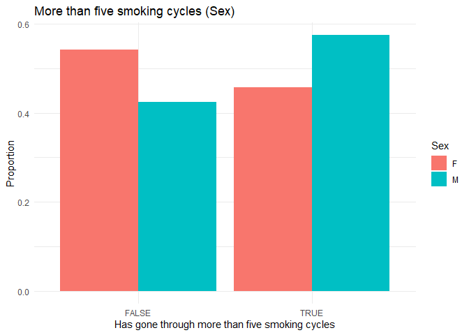
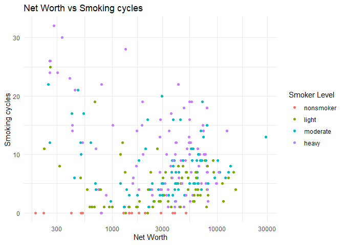

Challenge 13: Island Smoking
================
Christopher Nie
2025-05-11

- [Setup](#setup)
- [Data collection](#data-collection)
  - [The Islands](#the-islands)
  - [Population and Sampling Plan](#population-and-sampling-plan)
  - [Quantity of Interest](#quantity-of-interest)
  - [Covariates](#covariates)
  - [Question / Hypothesis](#question--hypothesis)
- [Analysis](#analysis)
  - [Setup](#setup-1)
  - [Smoking and Age](#smoking-and-age)
  - [Other factors](#other-factors)
  - [Heavy Smokers](#heavy-smokers)
- [Conclusion](#conclusion)

# Setup

``` r
library(tidyverse)
```

    ## ── Attaching core tidyverse packages ──────────────────────── tidyverse 2.0.0 ──
    ## ✔ dplyr     1.1.4     ✔ readr     2.1.5
    ## ✔ forcats   1.0.0     ✔ stringr   1.5.1
    ## ✔ ggplot2   3.5.1     ✔ tibble    3.2.1
    ## ✔ lubridate 1.9.4     ✔ tidyr     1.3.1
    ## ✔ purrr     1.0.2     
    ## ── Conflicts ────────────────────────────────────────── tidyverse_conflicts() ──
    ## ✖ dplyr::filter() masks stats::filter()
    ## ✖ dplyr::lag()    masks stats::lag()
    ## ℹ Use the conflicted package (<http://conflicted.r-lib.org/>) to force all conflicts to become errors

# Data collection

### The Islands

The Islands is virtual human population that simulates the descendents of
survivors from simultaneous shipwrecks across three islands. Initial settlements
have grown into twenty-seven villages with a combined population of over forty
thousand Islanders. The simulation models many aspects of a real population, 
which include birth, death, and movement to other villages. Islanders are also
able to perform many actions, many of which are recorded in their life history. 

I decided to study other Islands behavior. Specifically, I was interested
in how the smoking behavior works. This observational study explores the
various factors that may cause an individual islander to smoke more than
others.

Islanders have a tendency to become a smoker, then quit smoking after a
certain period of time. In this study, I will refer to this as a
“smoking cycle”. “Light smokers” can either 1) become a “nonsmoker” or
2) become a “moderate smoker.” A “moderate smoker” can either 1) drop
down to “light smoker” or 2) become a “heavy smoker.” A “heavy smoker”
will become a “moderate smoker” after a certain period of time. These
classifications are given in the individual Islander history. I will
refer to these classifications as Smoker level.

There may be some uncertainty because of the process of collecting data
from the Islands by hand. The Islands has a total virtual population of
~40,000. I have sampled 270 points, or ~0.675% of the total population.

### Population and Sampling Plan

I wanted to study trends across all continents. I decided to use
stratified sampling, where I randomly sampled 90 residents for each
continent, keeping people sampled from the towns proportional to its
size.

**Ironbard Population**

The sampled population of Ironbard is about 1% of the total population

| Town        | Total Population | Sampled Population |
|-------------|------------------|--------------------|
| *Hofn*      | 986              | 10                 |
| *Vardo*     | 3077             | 31                 |
| *Helvig*    | 1728             | 17                 |
| *Bjurholm*  | 1324             | 13                 |
| *Blonduos*  | 1067             | 11                 |
| *Helluland* | 868              | 9                  |
| **Total**   | 9050             | 91                 |

**Providence Population**

The sampled population of Providence is about 0.6% of the total
population

| Town       | Total Population | Sampled Population |
|------------|------------------|--------------------|
| *Hayarano* | 1118             | 7                  |
| *Akkeshi*  | 1068             | 6                  |
| *Reading*  | 2024             | 12                 |
| *Nelson*   | 903              | 5                  |
| *Shinobi*  | 4822             | 29                 |
| *Biruwa*   | 1495             | 9                  |
| *Takazaki* | 1003             | 6                  |
| *Kiyobico* | 1301             | 8                  |
| *Arcadia*  | 966              | 6                  |
| **Total**  | 14700            | 88                 |

**Bonne Sante**

The sampled population of Bonne Sante is about 0.5% of the total
population.

| Town      | Total Population | Sampled Population |
|-----------|------------------|--------------------|
| *Nidoma*  | 1055             | 5                  |
| *Talu*    | 821              | 4                  |
| *Pauma*   | 1038             | 5                  |
| *Valais*  | 905              | 5                  |
| *Kinsale* | 729              | 4                  |
| *Vaiku*   | 888              | 4                  |
| *Mahuti*  | 2649             | 13                 |
| *Eden*    | 1250             | 6                  |
| *Colmar*  | 5518             | 27                 |
| *Gordes*  | 1208             | 6                  |
| *Maeva*   | 862              | 4                  |
| *Riroua*  | 1210             | 6                  |
| **Total** | 18133            | 89                 |

### Quantity of Interest

An islander’s life history displays “light smoker”, “moderate smoker”,
“heavy smoker”, and “nonsmoker.” I use “nonsmoker” as the metric for
judging how many times an islander started smoking – they can only quit
if they started. For my quantity of interest, I was interested in
exploring how age affects how many times someone starts smoking (and
quits smoking).

### Covariates

Some covariates included are

- Continent

- Job

- Net Worth

- Sex

- Smoker Depth (light, moderate, heavy)

### Question / Hypothesis

This study aims to answer this question: *What factors cause an islander
to smoke?*

My hypothesis is that age is the biggest determining factor, since the
older the islander, the more chances they have to become a smoker.

# Analysis

### Setup

``` r
filename <- "./data/smoking_islands_data_ironbard_providence.csv"
df_data_ironbard_providence <- read.csv(filename) 

df_data_ip <- df_data_ironbard_providence %>% 
  select(-X,-X.1,-X.2,-Notes)

filename <- "./data/smoking_islands_data_bonneSante.csv"
df_data_bonneSante <- read.csv(filename)

df_data_bs <- df_data_bonneSante %>% 
  select(-X,-X.1,-X.2,-X.3, -X.4)

df_data <- full_join(
  df_data_ip, 
  df_data_bs, 
  by = c("continent","age", "job", "Net.wrth", "Gender", "first_smoke_age", "nonsmoke_instance", "smoker_depth", "town")) %>% 
  mutate(first_smoke_age = na_if(first_smoke_age, 0))
tail(df_data) 
```

    ##       continent age                                           job Net.wrth
    ## 255 Bonne Sante  40                                       Painter     2407
    ## 256 Bonne Sante  54 High School Teacher/Horticultural Association     8057
    ## 257 Bonne Sante  19                                   Cheesemaker      839
    ## 258 Bonne Sante  48                                    Bricklayer     3304
    ## 259 Bonne Sante  21                                  Running Club     2181
    ## 260 Bonne Sante  22                                     Carpenter     2419
    ##     Gender first_smoke_age nonsmoke_instance smoker_depth   town smoke_instance
    ## 255      M              19                 5            2 Riroua             12
    ## 256      F              22                 4            3 Riroua             12
    ## 257      M              18                 1            1 Riroua              2
    ## 258      M              21                10            3 Riroua             29
    ## 259      M              21                 0            1 Riroua              1
    ## 260      F              20                 1            1 Riroua              2
    ##     moderate_instance heavy_instance light_instance
    ## 255                 1              0              6
    ## 256                 2              1              5
    ## 257                 0              0              1
    ## 258                 4              1             14
    ## 259                 0              0              1
    ## 260                 0              0              1

Dataframe columns are:

- Continent

- Town

- Age

- job

- Net worth

- Gender

- first_smoke_instance: first case of “light smoker”

- nonsmoke_instance: number of instances of “nonsmoker”

- smoker_depth: shows the heaviest level of smoking recorded in their
  life history

- smoke_instance: shows the number of instances of “\_\_\_ smoker”

- light_Instance: shows the number of instances of “light smoker”

- moderate_instance: shows the number of instances of “moderate smoker”

- heavy_instance: shows the number of instances of “heavy smoker”

### Smoking and Age

#### Smoking Cycles

``` r
df_data %>% 
  filter(!is.na(first_smoke_age)) %>% 
  ggplot(aes(x = first_smoke_age, color = continent)) +
  geom_density() +  # Overlapping densities
  labs(
    title = "Distribution of First Smoking Age by Continent",
    x = "Age at First Smoking",
    y = "Density"
  ) +
  theme_minimal() +
  scale_color_brewer(palette = "Dark2")
```

<!-- -->

We see that the most common starting age is between 18 to 21, with 19
being the mode for all continents. Interestingly, Ironbard has a second
mode at 21. This starting age may suggest that someone younger (18-24)
may have only gone through one or two smoking cycles. To do this, I
filtered the data by age and checked the reoccurrence of smoking.

``` r
df_data %>% 
  filter(age<25) %>% 
  ggplot(aes(x = nonsmoke_instance, color = continent))+
  geom_density() + 
  theme_minimal() +
  labs(
    title = "Count of Smoking Instances (younger than 25)",
    x = "Smoking instances",
    y = "Density"
  )
```

<!-- -->

We can see that, in general for most continents, the densities are right
skewed, showing that most people in this age group have fewer smoking
cycles. We can also see that Ironbard seems to have a lot of nonsmokers,
at almost 50% of those younger than 25. Let’s see if this carries over
to older islanders (\>35).

``` r
df_data %>% 
  filter(age>30) %>% 
  ggplot(aes(x = nonsmoke_instance, color = continent))+
  geom_density() +
  theme_minimal() +
  labs(
    title = "Count of Smoking Instances (older than 35)",
    x = "Smoking Instances",
    y = "Density"
  )
```

<!-- -->

We can see that the median and mode shift to the right. The mode of
Providence is more concentrated around 8. Bonne Sante is slightly less
concentrated around 6, and Ironbard is spread out across 5 to 11. We can
also see this trend if we plotted everything on a scatterplot.

``` r
df_data %>% 
  mutate(smoker_depth = case_when(
    smoker_depth == 0 ~ "nonsmoker",
    smoker_depth == 1 ~ "light",
    smoker_depth == 2 ~ "moderate",
    smoker_depth == 3 ~ "heavy",
    TRUE ~ as.character(smoker_depth)
  )) %>% 
  mutate(smoker_depth = forcats::fct_relevel(smoker_depth, "nonsmoker", "light", "moderate", "heavy")) %>% 
  ggplot(aes(x = age, y = nonsmoke_instance, color = smoker_depth)) + 
  geom_point()+
  theme_minimal() +
  labs(
    title = "Age vs Smoking cycles",
    x = "Age",
    y = "Smoking cycles", 
    color = "Smoker Level"
  )
```

<!-- -->

This graph shows the general trend that smoking cycle increases with
age. However, it also shows another metric used to define the smokers:
Smoker Level. And unlike smoking cycles, it does not appear to be
directly correlated with age. It does, however, appear somewhat
correlated to smoking cycles.

#### Smoker Level

To explore smoker level, I tried plotting it directly against `Age` and
`nonsmoke_instance`. I also looked at the effects of `first_smoke_age`.
None of these graphs revealed any trends. I ended up filtering by age
and looking at their distributions.

``` r
df_data %>%
  mutate(smoker_depth = case_when(
    smoker_depth == 0 ~ "nonsmoker",
    smoker_depth == 1 ~ "light",
    smoker_depth == 2 ~ "moderate",
    smoker_depth == 3 ~ "heavy",
    TRUE ~ as.character(smoker_depth)
  )) %>% 
  mutate(smoker_depth = forcats::fct_relevel(smoker_depth, "nonsmoker", "light", "moderate", "heavy")) %>% 
  filter(nonsmoke_instance<=3) %>% 
  ggplot(aes(x = smoker_depth, fill = continent))+
  geom_bar(position = "dodge") + 
  theme_minimal() +
  labs(
    title = "Count of Smoker Levels (3 or less smoking cycles)",
    x = "Smoking Levels",
    color = "Continent"
  ) 
```

<!-- -->

``` r
df_data %>%
  mutate(smoker_depth = case_when(
    smoker_depth == 0 ~ "nonsmoker",
    smoker_depth == 1 ~ "light",
    smoker_depth == 2 ~ "moderate",
    smoker_depth == 3 ~ "heavy",
    TRUE ~ as.character(smoker_depth)
  )) %>% 
  mutate(smoker_depth = forcats::fct_relevel(smoker_depth, "nonsmoker", "light", "moderate", "heavy")) %>% 
  filter(nonsmoke_instance>=7) %>% 
  ggplot(aes(x = smoker_depth, fill = continent))+
  geom_bar(position = "dodge") + 
  theme_minimal() +
  labs(
    title = "Count of Smoker Levels (7 or more smoking cycles)",
    x = "Smoking Levels",
    color = "Continent"
  )
```

<!-- -->

From these graphs, we can see that the mode of the graph definitely
shifts to the right, suggesting that smoking cycles might be a valid
determiner of smoker level. This means that by extension, smoker level
is somewhat related to age, if only by proxy of smoking cycle. This
appears to be valid for all continents.

### Other factors

Some other factors I considered were

- Sex

- Employment status

- Net worth

#### Sex

This factor requires us to normalize our data, as we have 120 female
datapoints and 134 male datapoints.

``` r
df_data %>% 
  filter(Gender != "") %>% 
  mutate(is_smoker = (smoker_depth!=0)) %>% 
  group_by(Gender, is_smoker) %>% 
  summarise(count = n()) %>% 
  mutate(prop = count / sum(count)) %>% 
  ggplot(aes(x = is_smoker, y = prop, fill = Gender)) +
  geom_col(position = "dodge") + 
  theme_minimal() +
  labs(
    title = "Smoker vs non-smoker (Sex)",
    x = "Has smoked before",
    y = "Proportion",
    fill = "Sex"
  )
```

    ## `summarise()` has grouped output by 'Gender'. You can override using the
    ## `.groups` argument.

<!-- -->

It appears that proportionally, there are more female nonsmokers than
male nonsmokers, and more male smokers than female smokers. However, the
difference in proportions is ~2%, which may just be an artifact of the
sampling process and probably masked by uncertainty. In fact, the actual
count was 9 female nonsmokers and 7 male nonsmokers. Given our scale and
sampling limitations, we can only say that there is no meaningful
difference between genders regarding smoking.

However, this just shows whether or not an islander is likely to smoke
at all. On the islands, it appears that smoking is such widespread
behavior that it is rather uncommon to not have smoked at all. Thus, we
can look at whether sex is correlated with *smoking seriousness –* how
likely they are to go beyond a light smoker.

``` r
df_data %>% 
  filter(Gender != "") %>% 
  mutate(is_smoker = (smoker_depth>1)) %>% 
  group_by(Gender, is_smoker) %>% 
  summarise(count = n()) %>% 
  mutate(prop = count / sum(count)) %>% 
  ggplot(aes(x = is_smoker, y = prop, fill = Gender)) +
  geom_col(position = "dodge") + 
  theme_minimal() +
  labs(
    title = "non/light smoker vs moderate/heavy smoker (Sex)",
    x = "Is a Moderate or Heavy Smoker",
    y = "Proportion",
    fill = "Sex"
  )
```

    ## `summarise()` has grouped output by 'Gender'. You can override using the
    ## `.groups` argument.

<!-- -->

Here, we can see a statistically significant difference. There are more
female light smoker-only islanders than male light smoker-only
islanders. However, for both groups, \>50% end up as moderate or heavy
smokers, although the proportion for females are much closer to 50-50.
We can also refer to our original metric, number of smoke cycles.

``` r
df_data %>% 
  filter(Gender != "") %>% 
  mutate(is_smoker = (nonsmoke_instance>5)) %>% 
  group_by(Gender, is_smoker) %>% 
  summarise(count = n()) %>% 
  mutate(prop = count / sum(count)) %>% 
  ggplot(aes(x = is_smoker, y = prop, fill = Gender)) +
  geom_col(position = "dodge") + 
  theme_minimal() +
  labs(
    title = "More than five smoking cycles (Sex)",
    x = "Has gone through more than five smoking cycles",
    y = "Proportion",
    fill = "Sex"
  )
```

    ## `summarise()` has grouped output by 'Gender'. You can override using the
    ## `.groups` argument.

<!-- -->

This graph shows that most female islanders undergo less than five
smoking cycles, and most male islanders undergo more than five smoking
cycles.

To sum up this section, sex does not meaningful impact whether an
islander has smoked before. However, it does affect how deep the smoking
goes – whether it is smoking level or number of smoking cycles.

#### Employment status

This factor requires us to normalize the data, so that we can properly
see whether being employed significantly impacts the chance to smoke.

``` r
df_data %>% 
  filter(Gender != "") %>% 
  mutate(
    is_smoker = (smoker_depth!=0),
    is_employed = (job!="")
    ) %>% 
  group_by(is_employed, is_smoker) %>% 
  summarise(count = n()) %>% 
  mutate(prop = count / sum(count)) %>% 
  ggplot(aes(x = is_smoker, y = prop, fill = is_employed)) +
  geom_col(position = "dodge") + 
  theme_minimal() +
  labs(
    title = "Smoker vs non-smoker (Employment)",
    x = "Has smoked before",
    y = "Proportion",
    fill = "Employed"
  )
```

    ## `summarise()` has grouped output by 'is_employed'. You can override using the
    ## `.groups` argument.

<!-- -->

We see a pretty similar situation to the *smoker vs non-smoker (sex)*
graph. In this case, the proportion difference is ~1%, which is even
smaller. Thus, there is no statistically significant difference in
tendency to smoke whether an islander is employed or not employed.

However, just like the sex section, we can look at whether employment
affects the level of smoking.

``` r
df_data %>% 
  filter(Gender != "") %>% 
  mutate(
    is_smoker = (smoker_depth>1),
    is_employed = (job!="")
    ) %>% 
  group_by(is_employed, is_smoker) %>% 
  summarise(count = n()) %>% 
  mutate(prop = count / sum(count)) %>% 
  ggplot(aes(x = is_smoker, y = prop, fill = is_employed)) +
  geom_col(position = "dodge") + 
  theme_minimal() +
  labs(
    title = "non/light smoker vs moderate/heavy smoker (Employment)",
    x = "Is a Moderate or Heavy Smoker",
    y = "Proportion",
    fill = "Employed"
  )
```

    ## `summarise()` has grouped output by 'is_employed'. You can override using the
    ## `.groups` argument.

<!-- -->

``` r
df_data %>% 
  filter(Gender != "") %>% 
  mutate(
    is_smoker = (nonsmoke_instance>5),
    is_employed = (job!="")
    ) %>% 
  group_by(is_employed, is_smoker) %>% 
  summarise(count = n()) %>% 
  mutate(prop = count / sum(count)) %>% 
  ggplot(aes(x = is_smoker, y = prop, fill = is_employed)) +
  geom_col(position = "dodge") + 
  theme_minimal() +
  labs(
    title = "More than five smoking cycles (Employment)",
    x = "Has gone through more than five smoking cycles",
    y = "Proportion",
    fill = "Employed"
  )
```

    ## `summarise()` has grouped output by 'is_employed'. You can override using the
    ## `.groups` argument.

<!-- -->

These graphs show that, similar to sex, employment status does not
meaningful impact whether an islander has smoked before. However, it
does appear that unemployed islanders have a higher chance of becoming
moderate/heavy smokers than employed islanders, and also tend to go
through more smoking cycles. In fact, most employed islanders do not go
through more than 5 smoking cycles. However, this connection is a bit
trickier, as employment situation can change(whereas Islander sex
presumably cannot). Thus, it is possible that employment status is
merely a symptom of another (perhaps behavioral) characteristic that
determines whether an islander is prone to smoking. Regardless, the
sheer statistical difference showcased in this final graph reveals that
there might be something worth exploring.

Another possible reason for this difference might be simply be age. Most
older islanders are unemployed, and as established previously, older
islanders tend to undergo more smoking cycles.

#### Net worth

``` r
df_data %>% 
  mutate(smoker_depth = case_when(
    smoker_depth == 0 ~ "nonsmoker",
    smoker_depth == 1 ~ "light",
    smoker_depth == 2 ~ "moderate",
    smoker_depth == 3 ~ "heavy",
    TRUE ~ as.character(smoker_depth)
  )) %>% 
  mutate(smoker_depth = forcats::fct_relevel(smoker_depth, "nonsmoker", "light", "moderate", "heavy")) %>% 
  ggplot(aes(x = Net.wrth, y = nonsmoke_instance, color = smoker_depth)) + 
  geom_point()+
  scale_x_log10() + 
  theme_minimal() +
  labs(
    title = "Net Worth vs Smoking cycles",
    x = "Net Worth",
    y = "Smoking cycles", 
    color = "Smoker Level"
  )
```

    ## Warning: Removed 2 rows containing missing values or values outside the scale range
    ## (`geom_point()`).

<!-- -->

This graph shows that Net Worth and Smoking cycles may be negatively
correlated. As an islander gets richer, their smoking cycles goes down.
Notably, there are nonsmokers all along the net worth line. However,
when I was making the dataset, I realized that the net worth of older
islanders tended to be lower. Thus, it is possible that this correlation
might go back to age. Thus, I made this plot again, but changed the
color scale to be age.

``` r
df_data %>% 
  ggplot(aes(x = Net.wrth, y = nonsmoke_instance, color = age)) + 
  geom_point()+
  scale_x_log10() + 
  theme_minimal() +
  labs(
    title = "Net Worth vs Smoking cycles",
    x = "Net Worth",
    y = "Smoking cycles", 
    color = "Smoker Level"
  )
```

    ## Warning: Removed 2 rows containing missing values or values outside the scale range
    ## (`geom_point()`).

<!-- -->

We can see that the the higher points tended to just be those who were
older. As we go downwards on the smoking cycles axis, we see that the
color becomes darker, signifying the data points being younger. The
nonsmokers at the bottom are simply the 20 years old who haven’t started
smoking yet.

Thus, coming back to my hypothesis: *All smoking factors go to age.*

### Heavy Smokers

I was interested in the mechanism behind the heavy smokers. When I was
collecting the data for Bonne Sante, I realized that I could simply
record the instances of `light smoker`, `moderate smoker` and
`heavy smoker`. This would let me see whether the number of
`light smoker` instances was correlated with whether an islander would
become a `moderate smoker`, and whether the number of `moderate smoker`
instances was correlated with an islander’s tendency to become a
`heavy smoker`.

``` r
df_data %>% 
  filter(!is.na(moderate_instance)) %>% 
  mutate(smoker_depth = case_when(
    smoker_depth == 0 ~ "nonsmoker",
    smoker_depth == 1 ~ "light",
    smoker_depth == 2 ~ "moderate",
    smoker_depth == 3 ~ "heavy",
    TRUE ~ as.character(smoker_depth)
  )) %>% 
  mutate(smoker_depth = forcats::fct_relevel(smoker_depth, "nonsmoker", "light", "moderate", "heavy")) %>% 
  ggplot(aes(x = light_instance, y = moderate_instance, color = smoker_depth))+
  geom_point() + 
  theme_minimal() +
  labs(
    title = "Light smoker instance vs Moderate smoker instance",
    x = "Light smoker instance",
    y = "Moderate smoker instance", 
    color = "Smoker Level"
  )
```

<!-- -->

``` r
df_data %>% 
  filter(!is.na(moderate_instance)) %>% 
  mutate(smoker_depth = case_when(
    smoker_depth == 0 ~ "nonsmoker",
    smoker_depth == 1 ~ "light",
    smoker_depth == 2 ~ "moderate",
    smoker_depth == 3 ~ "heavy",
    TRUE ~ as.character(smoker_depth)
  )) %>% 
  mutate(smoker_depth = forcats::fct_relevel(smoker_depth, "nonsmoker", "light", "moderate", "heavy")) %>% 
  ggplot(aes(x = moderate_instance, y = heavy_instance, color = smoker_depth))+
  geom_point()+
  geom_point() + 
  theme_minimal() +
  labs(
    title = "Moderate smoker instance vs Heavy smoker instance",
    x = "Moderate smoker instance",
    y = "Heavy smoker instance", 
    color = "Smoker Level"
  )
```

<!-- -->

In general, we can see that the instances increase with each other. This
is because in order for an islander to be a moderate smoker, they must
first be a light smoker, and in order for an islander to be a heavy
smoker, they must first be a moderate smoker. Additionally, in order to
become a nonsmoker, they must drop down to light smoker before they can
become a nonsmoker. This means that in general, for any given islander,
there must be more light smoker instances than moderate smoker
instances, and more moderate smoker instances than heavy smoker
instances. It appears that most islanders follow this circle, where they
will drop all the way down before starting another smoking cycle.
However, there are exceptions. For example, there is a point (2,5) on
the *Light smoker instance vs Moderate smoker instance* graph. This is
because the the person became a light smoker, then a moderate smoker,
then bounced between moderate and heavy smoker. However, this seems to
be the only data point with this characteristic.

Another way we can look at the graph is playing the game of
probabilities. Just like how age determines how many smoking cycles an
islander goes through, more light smoker instances increases the
probability that eventually one of them becomes a moderate smoker
instance.

# Conclusion

From the analysis, we can see that, of the visible factors collected,
age is most heavily correlated to the number of smoking cycles. Smoking
cycles seem to be correlated with smoker level. Some of the other
factors we looked at, such as employment or economic status, could have
simply been proxies for age. We were also able to see how the light
smoker, moderate smoker, and heavy smoker state were connected. However,
the actual stochastic model behind it is still a mystery. Perhaps time
in each state is important. Unfortunately, that would have been too
difficult to collect and analyze, especially as many islanders went
through multiple smoking cycles.

My sample of 90 from each continent resulted in 270 islanders. The total
population of the islands is 40,000. This gives me a **6% confidence
interval at a 95% confidence level**. [For most research conducted at
the population level, researchers look for at least 385
samples.](https://www.geopoll.com/blog/sample-size-research/#:~:text=As%20demonstrated%20through%20the%20calculation,are%20often%20used%20in%20research.)
Thus, raising the sample to this level would improve our confidence
interval.

Some questions remain. Family history, such as genetics or parent
behavior, may affect the smoking behavior of any children they have. In
other words, is smoking “infectious” – can an islander make the people
around them more likely to smoke if they smoke? Another question that
remains is how a light smoker becomes a moderate smoker, and a moderate
smoker a heavy smoker. Is it the “same” randomness across all islanders,
or are some islanders inherently more susceptible to it? The stance I
have taken is that it is the same across all islanders, but the older
islanders have more time for the probability hammer to fall. However, if
this were completely true, then why are there islanders who have 4 heavy
smoker instances and 4 moderate smoker instances when there are
islanders who have 9 moderate smoker instances but only 1 heavy smoker
instances? Why are there islanders that have hit 19 light smoker
instances but only 1 moderate smoker instance? Or 11 light smoker
instances but no moderate smoker instances? One factor I considered
collecting was time in each state, but it was unfeasible for me to
collect that data. It would definitely be an interesting to see how long
an islander stays in each state, and whether this is correlated to their
smoker level or smoking cycles.

Another direction to explore would be looking at the percentage of light
smokers that become nonsmokers, and the percentage of light smokers that
become moderate smokers. The current data set is unfortunately too
limited to pursue this question.

Finally, the biggest question of all remains: why do more than 90% of
islanders smoke at least once in their life?
